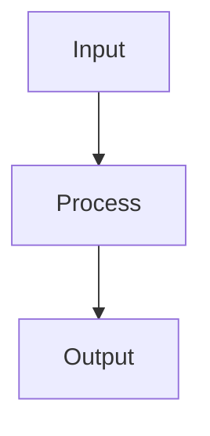

# Ensemble Methods

## Detailed Explanation

Combines multiple models via bagging, boosting, stacking...

## Core Intuition

A key technique in machine learning.

## How It Works

1. Train multiple diverse base learners on the training data (can be same algorithm with different hyperparameters, or different algorithms)
2. For bagging (e.g., Random Forest): train each base learner on a bootstrap sample of the data; average predictions to reduce variance
3. For boosting (e.g., GBM): train base learners sequentially, where each learner corrects the errors of the previous ensemble
4. For stacking: generate out-of-fold predictions from base learners; use these as features to train a meta-learner
5. For voting classifiers: combine predictions by majority vote (hard voting) or average probabilities (soft voting)
6. Combine base learner predictions using the chosen aggregation: mean/vote (bagging), weighted sum (boosting), meta-learner output (stacking)
7. Validate that the ensemble outperforms the best individual base learner on a held-out test set



## Architecture / Trade-offs

Trade-off 1 vs trade-off 2

## Interview Q&A

**Q: Why is diversity important in ensemble methods?**
A: If all models make identical predictions, averaging them doesn't help — the ensemble error equals the individual error. Diversity (uncorrelated errors) is what makes ensembles powerful: when models make different mistakes, averaging cancels out errors. Random Forests create diversity via feature subsampling; boosting creates diversity via sequential error-correction. An ensemble of 3 diverse models often outperforms an ensemble of 100 correlated models.

**Q: When does stacking improve over simple averaging?**
A: Stacking learns the optimal weighting (and interactions) between base models, while averaging assigns equal weight. Stacking helps when base models have different strengths on different parts of the input space — the meta-learner learns to route predictions. Simple averaging is sufficient when models are similar in quality and errors. Stacking often provides 0.5-2% accuracy gains in competitions but adds complexity in production.

**Q: What is the key risk in stacking implementation?**
A: Training the meta-learner on base model predictions generated from the same training data causes data leakage — the base models have memorized the training labels, so their training predictions are too optimistic. The meta-learner then learns to trust overfitted base models. Fix: generate meta-features using out-of-fold cross-validation predictions — base models are never evaluated on their own training data.

**Q: When would you NOT use an ensemble?**
A: When inference latency is critical (k models = k× prediction time); when model interpretability is required (stacked ensemble is a black box even if components are interpretable); when the dataset is too small (ensembles need diverse errors to be beneficial, hard with limited data); when you need to deploy, monitor, and retrain a single model (operational complexity multiplies with ensemble size).

**Q: How does boosting reduce bias while bagging reduces variance?**
A: Bagging trains models independently on bootstrap samples and averages — averaging reduces variance (reduces sensitivity to training data noise) without affecting bias. Boosting trains models sequentially, each correcting the previous model's errors — each iteration focuses the model on hard examples, reducing the bias (systematic underfitting) of the combined model. Boosting uses very shallow weak learners (stumps) to avoid adding variance.

**Q: What is model blending vs stacking?**
A: Blending trains base models on the full training set, generates predictions on a held-out validation set, and trains the meta-learner on those predictions. Stacking uses cross-validation to generate meta-features, so all training data is used and overfitting risk is lower. Blending is simpler and faster but wastes data (the held-out set isn't used for base model training). In competitions, stacking is preferred; in production, blending's simplicity often wins.
## Best Practices

- Use soft voting (probability averaging) over hard voting when models are calibrated
- Stack with a simple meta-learner (logistic regression, ridge) — complex meta-learners overfit
- Use out-of-fold predictions to generate meta-features for stacking
- Ensure base models are diverse (different algorithms, feature subsets) — correlated models don't help
- Use cross_val_predict with cv=5 for stacking meta-features
- Blend models trained on different data subsets or preprocessing pipelines
- Monitor whether ensemble improves over best single model — overhead may not be worth it

## Common Pitfalls

- Blending base models trained on the full training set — meta-learner overfits to training predictions
- Stacking many similar models doesn't add diversity — only reduces variance marginally
- Ensemble overhead at inference — 10 models = 10x prediction cost
- Forgetting to calibrate probabilities before soft voting averages them


## Code Examples

### Example 1: Voting and Averaging Ensemble

```python
import numpy as np
from sklearn.datasets import make_classification
from sklearn.model_selection import train_test_split, cross_val_score
from sklearn.ensemble import VotingClassifier, RandomForestClassifier, GradientBoostingClassifier
from sklearn.linear_model import LogisticRegression
from sklearn.svm import SVC
from sklearn.metrics import accuracy_score

X, y = make_classification(n_samples=600, n_features=20, n_informative=12, random_state=42)
X_train, X_test, y_train, y_test = train_test_split(X, y, test_size=0.2, random_state=42)

# Individual models
rf = RandomForestClassifier(n_estimators=100, random_state=42)
gb = GradientBoostingClassifier(n_estimators=100, random_state=42)
lr = LogisticRegression(max_iter=1000)
svc = SVC(probability=True)

# Hard voting
hard_voter = VotingClassifier([('rf', rf), ('gb', gb), ('lr', lr)], voting='hard')
# Soft voting (uses predicted probabilities)
soft_voter = VotingClassifier([('rf', rf), ('gb', gb), ('svc', svc)], voting='soft')

for name, model in [('RF', rf), ('GB', gb), ('LR', lr), ('Hard', hard_voter), ('Soft', soft_voter)]:
    scores = cross_val_score(model, X_train, y_train, cv=5, scoring='accuracy')
    print(f"{name:6s}: {scores.mean():.4f} ± {scores.std():.4f}")
```

### Example 2: Stacking Ensemble

```python
from sklearn.ensemble import StackingClassifier
from sklearn.model_selection import cross_val_score

base_estimators = [
    ('rf', RandomForestClassifier(n_estimators=50, random_state=42)),
    ('gb', GradientBoostingClassifier(n_estimators=50, random_state=42)),
    ('lr', LogisticRegression(max_iter=1000)),
]
# Meta-learner (level-1 model)
meta_learner = LogisticRegression(max_iter=1000)

stacking = StackingClassifier(
    estimators=base_estimators,
    final_estimator=meta_learner,
    cv=5,  # k-fold for generating meta-features
    passthrough=False  # Don't pass original features to meta-learner
)

scores = cross_val_score(stacking, X_train, y_train, cv=5, scoring='accuracy')
print(f"Stacking CV: {scores.mean():.4f} ± {scores.std():.4f}")

stacking.fit(X_train, y_train)
test_acc = accuracy_score(y_test, stacking.predict(X_test))
print(f"Stacking test accuracy: {test_acc:.4f}")
```

### Example 3: Boosting vs Bagging Analysis

```python
from sklearn.ensemble import AdaBoostClassifier, BaggingClassifier
from sklearn.tree import DecisionTreeClassifier
import matplotlib.pyplot as plt

X, y = make_classification(n_samples=500, n_features=15, n_informative=8, random_state=42)

n_estimators_range = range(10, 201, 10)
results = {'Bagging': [], 'AdaBoost': [], 'RandomForest': []}

for n in n_estimators_range:
    bagging = BaggingClassifier(DecisionTreeClassifier(max_depth=5), n_estimators=n, random_state=42)
    ada = AdaBoostClassifier(DecisionTreeClassifier(max_depth=1), n_estimators=n, random_state=42)
    rf = RandomForestClassifier(n_estimators=n, random_state=42)

    for name, model in [('Bagging', bagging), ('AdaBoost', ada), ('RandomForest', rf)]:
        score = cross_val_score(model, X, y, cv=3, scoring='accuracy').mean()
        results[name].append(score)

plt.figure(figsize=(10, 5))
for name, scores in results.items():
    plt.plot(list(n_estimators_range), scores, label=name, marker='o', markersize=3)
plt.xlabel('n_estimators'), plt.ylabel('CV Accuracy')
plt.title('Ensemble Size: Boosting vs Bagging vs Random Forest')
plt.legend(), plt.show()
```

## Related Concepts

- [Gradient Descent](./01-gradient-descent.md)
- [Cross-Validation](./22-cross-validation.md)
- [Hyperparameter Tuning](./26-hyperparameter-tuning.md)
