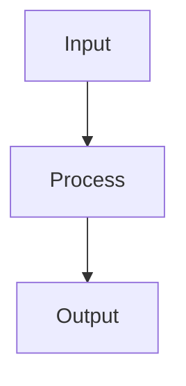

# Ensemble Methods

## Detailed Explanation

Combines multiple models via bagging, boosting, stacking...

## Core Intuition

A key technique in machine learning.

## How It Works

1. Step 1
2. Step 2
3. Step 3



## Architecture / Trade-offs

Trade-off 1 vs trade-off 2

## Interview Q&A

**Q: When would you use Ensemble Methods?**
A: Context-dependent, varies by problem type.

**Q: What are the main trade-offs?**
A: Refer to Architecture / Trade-offs section above.

**Q: How do you choose hyperparameters?**
A: Cross-validation, grid/random/Bayesian search, domain knowledge.

**Q: What are common failure modes?**
A: Refer to Common Pitfalls section below.

## Best Practices

- Practice 1
- Practice 2
- Practice 3

## Common Pitfalls

- Pitfall 1
- Pitfall 2


## Code Examples

### Example 1: Voting and Averaging Ensemble

```python
import numpy as np
from sklearn.datasets import make_classification
from sklearn.model_selection import train_test_split, cross_val_score
from sklearn.ensemble import VotingClassifier, RandomForestClassifier, GradientBoostingClassifier
from sklearn.linear_model import LogisticRegression
from sklearn.svm import SVC
from sklearn.metrics import accuracy_score

X, y = make_classification(n_samples=600, n_features=20, n_informative=12, random_state=42)
X_train, X_test, y_train, y_test = train_test_split(X, y, test_size=0.2, random_state=42)

# Individual models
rf = RandomForestClassifier(n_estimators=100, random_state=42)
gb = GradientBoostingClassifier(n_estimators=100, random_state=42)
lr = LogisticRegression(max_iter=1000)
svc = SVC(probability=True)

# Hard voting
hard_voter = VotingClassifier([('rf', rf), ('gb', gb), ('lr', lr)], voting='hard')
# Soft voting (uses predicted probabilities)
soft_voter = VotingClassifier([('rf', rf), ('gb', gb), ('svc', svc)], voting='soft')

for name, model in [('RF', rf), ('GB', gb), ('LR', lr), ('Hard', hard_voter), ('Soft', soft_voter)]:
    scores = cross_val_score(model, X_train, y_train, cv=5, scoring='accuracy')
    print(f"{name:6s}: {scores.mean():.4f} ± {scores.std():.4f}")
```

### Example 2: Stacking Ensemble

```python
from sklearn.ensemble import StackingClassifier
from sklearn.model_selection import cross_val_score

base_estimators = [
    ('rf', RandomForestClassifier(n_estimators=50, random_state=42)),
    ('gb', GradientBoostingClassifier(n_estimators=50, random_state=42)),
    ('lr', LogisticRegression(max_iter=1000)),
]
# Meta-learner (level-1 model)
meta_learner = LogisticRegression(max_iter=1000)

stacking = StackingClassifier(
    estimators=base_estimators,
    final_estimator=meta_learner,
    cv=5,  # k-fold for generating meta-features
    passthrough=False  # Don't pass original features to meta-learner
)

scores = cross_val_score(stacking, X_train, y_train, cv=5, scoring='accuracy')
print(f"Stacking CV: {scores.mean():.4f} ± {scores.std():.4f}")

stacking.fit(X_train, y_train)
test_acc = accuracy_score(y_test, stacking.predict(X_test))
print(f"Stacking test accuracy: {test_acc:.4f}")
```

### Example 3: Boosting vs Bagging Analysis

```python
from sklearn.ensemble import AdaBoostClassifier, BaggingClassifier
from sklearn.tree import DecisionTreeClassifier
import matplotlib.pyplot as plt

X, y = make_classification(n_samples=500, n_features=15, n_informative=8, random_state=42)

n_estimators_range = range(10, 201, 10)
results = {'Bagging': [], 'AdaBoost': [], 'RandomForest': []}

for n in n_estimators_range:
    bagging = BaggingClassifier(DecisionTreeClassifier(max_depth=5), n_estimators=n, random_state=42)
    ada = AdaBoostClassifier(DecisionTreeClassifier(max_depth=1), n_estimators=n, random_state=42)
    rf = RandomForestClassifier(n_estimators=n, random_state=42)

    for name, model in [('Bagging', bagging), ('AdaBoost', ada), ('RandomForest', rf)]:
        score = cross_val_score(model, X, y, cv=3, scoring='accuracy').mean()
        results[name].append(score)

plt.figure(figsize=(10, 5))
for name, scores in results.items():
    plt.plot(list(n_estimators_range), scores, label=name, marker='o', markersize=3)
plt.xlabel('n_estimators'), plt.ylabel('CV Accuracy')
plt.title('Ensemble Size: Boosting vs Bagging vs Random Forest')
plt.legend(), plt.show()
```

## Related Concepts

- [Gradient Descent](./01-gradient-descent.md)
- [Cross-Validation](./22-cross-validation.md)
- [Hyperparameter Tuning](./26-hyperparameter-tuning.md)
