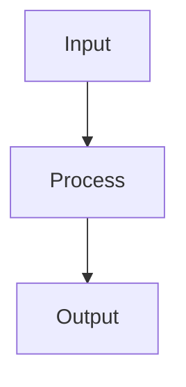

# Bayesian Inference

## Detailed Explanation

Combines prior beliefs with data via Bayes' theorem...

## Core Intuition

A key technique in machine learning.

## How It Works

1. Step 1
2. Step 2
3. Step 3



## Architecture / Trade-offs

Trade-off 1 vs trade-off 2

## Interview Q&A

**Q: When would you use Bayesian Inference?**
A: Context-dependent, varies by problem type.

**Q: What are the main trade-offs?**
A: Refer to Architecture / Trade-offs section above.

**Q: How do you choose hyperparameters?**
A: Cross-validation, grid/random/Bayesian search, domain knowledge.

**Q: What are common failure modes?**
A: Refer to Common Pitfalls section below.

## Best Practices

- Practice 1
- Practice 2
- Practice 3

## Common Pitfalls

- Pitfall 1
- Pitfall 2


## Code Examples

### Example 1: Bayesian Coin Flip Update

```python
import numpy as np
import matplotlib.pyplot as plt
from scipy import stats

# Prior: Beta distribution (represents beliefs about p_heads)
alpha_prior, beta_prior = 2, 2  # Weak prior: slightly prefer fair coin

# Observe coin flips
np.random.seed(42)
true_p = 0.7
observations = np.random.binomial(1, true_p, size=100)

p_range = np.linspace(0, 1, 500)
fig, axes = plt.subplots(1, 4, figsize=(16, 4))

for i, n_obs in enumerate([0, 5, 20, 100]):
    heads = observations[:n_obs].sum() if n_obs > 0 else 0
    tails = n_obs - heads
    # Posterior: Beta(alpha_prior + heads, beta_prior + tails)
    alpha_post = alpha_prior + heads
    beta_post = beta_prior + tails
    posterior = stats.beta(alpha_post, beta_post)

    axes[i].plot(p_range, stats.beta(alpha_prior, beta_prior).pdf(p_range), 'b--', label='Prior', alpha=0.5)
    axes[i].plot(p_range, posterior.pdf(p_range), 'r-', label='Posterior')
    axes[i].axvline(true_p, color='g', linestyle=':', label='True p')
    axes[i].set_title(f'After {n_obs} flips (H={heads})')
    axes[i].set_xlabel('p(heads)'), axes[i].legend()

plt.tight_layout(), plt.show()
print(f"Final posterior: mean={alpha_post/(alpha_post+beta_post):.3f}, "
      f"95% CI={stats.beta(alpha_post, beta_post).interval(0.95)}")
```

### Example 2: MAP vs MLE Estimation

```python
import numpy as np
import matplotlib.pyplot as plt
from scipy import stats

np.random.seed(42)
# Small dataset: n=10, true mean=5, true sigma=2
n = 10
true_mu, true_sigma = 5.0, 2.0
data = np.random.normal(true_mu, true_sigma, n)

# MLE: just the sample mean and std
mle_mu = data.mean()
mle_sigma = data.std()

# MAP with Gaussian prior on mean: mu_prior=0, sigma_prior=3
mu_prior, sigma_prior = 0.0, 3.0
# MAP posterior mean: weighted average of prior and MLE
precision_prior = 1 / sigma_prior**2
precision_likelihood = n / true_sigma**2
map_mu = (precision_prior * mu_prior + precision_likelihood * mle_mu) / (precision_prior + precision_likelihood)

print(f"True mu:  {true_mu:.3f}")
print(f"MLE mu:   {mle_mu:.3f}  (shrinkage toward prior: {abs(mle_mu - true_mu):.3f} error)")
print(f"MAP mu:   {map_mu:.3f}  (shrinkage toward prior: {abs(map_mu - true_mu):.3f} error)")
print(f"\nMAP pulls estimate from MLE={mle_mu:.3f} toward prior={mu_prior:.1f}")
print(f"MAP estimate: {map_mu:.3f} (halfway between for this prior strength)")
```

### Example 3: Bayesian Linear Regression

```python
import numpy as np
import matplotlib.pyplot as plt
from scipy import stats

np.random.seed(42)
n = 30
X_data = np.linspace(-3, 3, n)
true_slope, true_intercept = 2.0, 1.0
y_data = true_intercept + true_slope * X_data + np.random.randn(n)

# Bayesian linear regression (conjugate prior)
# Prior: w ~ N(0, alpha^-1 * I), noise precision beta
alpha, beta = 1.0, 1.0  # Prior precision, noise precision

# Design matrix
Phi = np.c_[np.ones(n), X_data]  # (n, 2)

# Posterior: S_N = (alpha*I + beta * Phi^T Phi)^-1
S_N_inv = alpha * np.eye(2) + beta * Phi.T @ Phi
S_N = np.linalg.inv(S_N_inv)
m_N = beta * S_N @ Phi.T @ y_data  # Posterior mean

print(f"True:              intercept={true_intercept:.2f}, slope={true_slope:.2f}")
print(f"Posterior mean:    intercept={m_N[0]:.2f}, slope={m_N[1]:.2f}")
print(f"Posterior std:     intercept={np.sqrt(S_N[0,0]):.4f}, slope={np.sqrt(S_N[1,1]):.4f}")

# Predictive distribution
X_test = np.linspace(-4, 4, 100)
Phi_test = np.c_[np.ones(100), X_test]
pred_mean = Phi_test @ m_N
pred_var = 1/beta + np.sum(Phi_test @ S_N * Phi_test, axis=1)

plt.figure(figsize=(10, 5))
plt.scatter(X_data, y_data, alpha=0.6, label='Data')
plt.plot(X_test, pred_mean, 'r-', label='Posterior mean')
plt.fill_between(X_test, pred_mean - 2*np.sqrt(pred_var),
                  pred_mean + 2*np.sqrt(pred_var), alpha=0.2, color='r', label='95% CI')
plt.legend(), plt.title('Bayesian Linear Regression'), plt.show()
```

## Related Concepts

- [Gradient Descent](./01-gradient-descent.md)
- [Cross-Validation](./22-cross-validation.md)
- [Hyperparameter Tuning](./26-hyperparameter-tuning.md)
