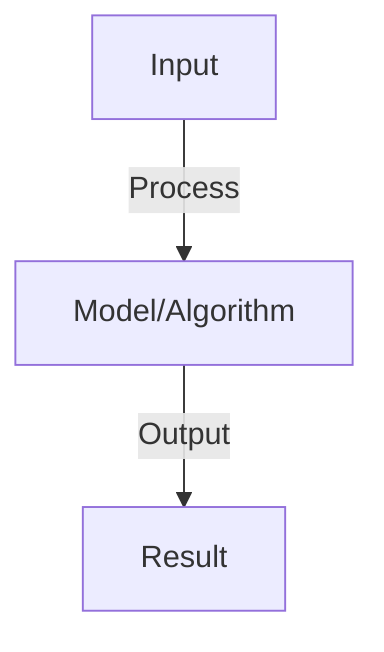

# Reinforcement Learning Basics

## Detailed Explanation

Understand agents learning to maximize reward through interaction with an environment, without labeled data

## Core Intuition

Understand agents learning to maximize reward through interaction with an environment, without labeled data Core idea: understand the fundamental principle and how it applies.

## How It Works

1. Agent: makes decisions in environment
2. Environment: responds to actions, gives rewards and observations
3. Markov Decision Process (MDP): states, actions, transitions, rewards
4. Goal: maximize cumulative reward (discount future rewards: γ^t × reward_t)
5. Policy π: maps states to actions (deterministic or stochastic)
6. Value function V(s): expected cumulative reward from state s
7. Q-function Q(s,a): expected cumulative reward from state s, action a
8. Learning: improve policy by estimating V or Q, then act greedily

## Architecture / Trade-offs

Trade-off 1 vs trade-off 2 — consider context and requirements.

## Interview Q&A

**Q: What's the difference between on-policy and off-policy learning?**
A: On-policy: learn from current policy (REINFORCE). Off-policy: learn from different policy (Q-learning). Off-policy is sample-efficient but harder (importance weighting). On-policy is simpler but needs more samples.

**Q: Why is the discount factor γ important?**
A: γ < 1 makes future rewards worth less (rewards closer are worth more). γ close to 1: agent plans long-term. γ close to 0: agent myopic (immediate reward only). Choose based on task: long-horizon = larger γ.

**Q: What is the exploration-exploitation tradeoff?**
A: Exploitation: use best known action. Exploration: try new actions to find better ones. Epsilon-greedy: choose random action with probability ε, greedy otherwise. Critical for learning.

**Q: How do you handle continuous action spaces?**
A: Discrete: Q(s,a) table or network. Continuous: policy gradient (output action directly). Example: actor-critic where actor outputs mean/variance of action distribution, critic estimates value.

**Q: What makes RL training unstable?**
A: Non-stationary target (V(s) changes as policy improves). Correlation in samples (action depends on previous actions). Solution: target network (update slowly), replay buffer (decorrelate samples), gradient clipping.

## Best Practices

- Research and implement best practices as you learn the concept
- Consider production implications and scalability
- Test on realistic data and benchmarks
- Monitor performance and iterate

## Common Pitfalls

- Oversimplifying the problem — understand nuances
- Ignoring computational costs and practicality
- Not validating assumptions with real data
- Premature optimization without profiling

## Code Examples

See concept implementation and real-world examples in the associated notebook.

## Related Concepts

- Review foundational concepts first
- Understand prerequisites before advanced topics
- Connect concepts to build integrated knowledge
