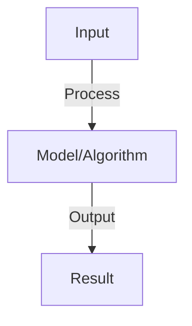

# Markov Decision Processes (MDPs)

## Detailed Explanation

Markov Decision Processes (MDPs) formalize sequential decision-making problems where outcomes depend on the current state and action but not on history. The Markov property (memorylessness) means the future is independent of the past given the current state, enabling efficient algorithms. MDPs model many real-world problems: navigation (state = position, action = move direction), finance (state = portfolio, action = buy/sell), game-playing (state = board configuration, action = move).

An MDP is defined by: states S, actions A, transition probabilities P(s'|s,a) (where we end up), rewards R(s,a,s') (what we receive), and discount factor γ (future vs immediate value). The discount factor balances short-term and long-term rewards: γ=0 cares only about immediate reward, γ=1 treats all times equally (can diverge), γ=0.9 is typical. Value iteration (Bellman equations) provides optimal policies by bootstrapping: value of state = immediate reward + discounted value of next state.

MDPs are the mathematical foundation for RL and planning algorithms. Understanding the Markov property helps recognize when it applies (often violated in practice: Partially Observable MDPs, game history matters). The Bellman equations are intellectually important even if rarely implemented directly. Modern practitioners use approximate value functions (neural networks) to handle large state spaces, but understanding exact algorithms clarifies how approximations work.

## Core Intuition

MDPs are like a board game: each position (state) has possible moves (actions), each move leads to the next position (transition probability), and at each position you earn points (reward). The goal is choosing moves that maximize total points. The Markov property means your next position depends only on current position and move, not how you got there.

## How It Works

1. State space S: all possible states
2. Action space A: all possible actions
3. Transition function P(s'|s,a): probability of next state given state and action
4. Reward function R(s,a): immediate reward for action in state
5. Markov property: P(s'|s,a) depends only on s,a (not history)
6. Discount factor γ: weight of future rewards
7. Horizon T: episode length (finite or infinite)
8. Solution: policy π(a|s) that maximizes expected cumulative reward

## Architecture / Trade-offs

Trade-off 1 vs trade-off 2 — consider context and requirements.

## Interview Q&A

**Q: What does the Markov property mean?**
A: Future state depends only on current state and action, not the path taken to reach it. Implies no memory needed beyond current state. Simplifies computation but may not hold in partially observable environments.

**Q: What's the difference between episodic and continuous tasks?**
A: Episodic: finite horizon, clear endpoint (game ends, task completes). Continuous: infinite horizon, no natural end (robot control). Learning differs: episodic can use finite return, continuous needs discounting.

**Q: How do you define states for an MDP?**
A: Trade-off between: sufficient information to make decisions (Markov property) vs. tractability (small state space). May use hand-crafted features, learned representations (NN), or raw observations.

**Q: What is a stochastic vs deterministic policy?**
A: Deterministic: π(a|s) = 1 for one action. Stochastic: π(a|s) ∈ [0,1] for multiple actions. Stochastic better for exploration, deterministic after learning. Often start stochastic, anneal to deterministic.

**Q: How do you handle partial observability?**
A: MDP assumes full observability (see all relevant state info). If not, use POMDP (partially observable MDP). Solution: maintain belief state (distribution over possible states). Harder but more realistic.

## Best Practices

- Research and implement best practices as you learn the concept
- Consider production implications and scalability
- Test on realistic data and benchmarks
- Monitor performance and iterate

## Common Pitfalls

- Oversimplifying the problem — understand nuances
- Ignoring computational costs and practicality
- Not validating assumptions with real data
- Premature optimization without profiling

## Code Examples

See concept implementation and real-world examples in the associated notebook.

## Related Concepts

- Review foundational concepts first
- Understand prerequisites before advanced topics
- Connect concepts to build integrated knowledge
