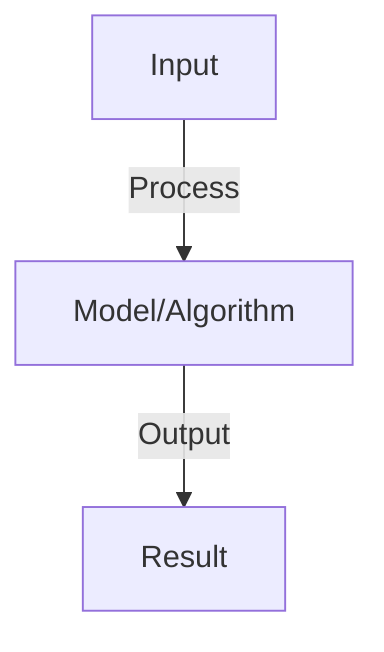

# Markov Decision Processes (MDPs)

## Detailed Explanation

Formalize sequential decision-making as MDPs with states, actions, transitions, and rewards

## Core Intuition

Formalize sequential decision-making as MDPs with states, actions, transitions, and rewards Core idea: understand the fundamental principle and how it applies.

## How It Works

1. State space S: all possible states
2. Action space A: all possible actions
3. Transition function P(s'|s,a): probability of next state given state and action
4. Reward function R(s,a): immediate reward for action in state
5. Markov property: P(s'|s,a) depends only on s,a (not history)
6. Discount factor γ: weight of future rewards
7. Horizon T: episode length (finite or infinite)
8. Solution: policy π(a|s) that maximizes expected cumulative reward

## Architecture / Trade-offs

Trade-off 1 vs trade-off 2 — consider context and requirements.

## Interview Q&A

**Q: What does the Markov property mean?**
A: Future state depends only on current state and action, not the path taken to reach it. Implies no memory needed beyond current state. Simplifies computation but may not hold in partially observable environments.

**Q: What's the difference between episodic and continuous tasks?**
A: Episodic: finite horizon, clear endpoint (game ends, task completes). Continuous: infinite horizon, no natural end (robot control). Learning differs: episodic can use finite return, continuous needs discounting.

**Q: How do you define states for an MDP?**
A: Trade-off between: sufficient information to make decisions (Markov property) vs. tractability (small state space). May use hand-crafted features, learned representations (NN), or raw observations.

**Q: What is a stochastic vs deterministic policy?**
A: Deterministic: π(a|s) = 1 for one action. Stochastic: π(a|s) ∈ [0,1] for multiple actions. Stochastic better for exploration, deterministic after learning. Often start stochastic, anneal to deterministic.

**Q: How do you handle partial observability?**
A: MDP assumes full observability (see all relevant state info). If not, use POMDP (partially observable MDP). Solution: maintain belief state (distribution over possible states). Harder but more realistic.

## Best Practices

- Research and implement best practices as you learn the concept
- Consider production implications and scalability
- Test on realistic data and benchmarks
- Monitor performance and iterate

## Common Pitfalls

- Oversimplifying the problem — understand nuances
- Ignoring computational costs and practicality
- Not validating assumptions with real data
- Premature optimization without profiling

## Code Examples

See concept implementation and real-world examples in the associated notebook.

## Related Concepts

- Review foundational concepts first
- Understand prerequisites before advanced topics
- Connect concepts to build integrated knowledge
