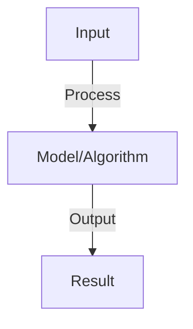

# Q-Learning

## Detailed Explanation

Q-Learning is a foundational reinforcement learning algorithm that enables agents to learn optimal decision-making policies through trial-and-error interaction with an environment. Unlike supervised learning, Q-Learning doesn't require labeled examples—instead, the agent learns by receiving rewards or penalties for its actions and updating its understanding of which state-action pairs are valuable.

The core insight is that every state-action pair has a Q-value representing the expected cumulative future reward. By iteratively updating these values based on observed rewards and the maximum future value of the next state, the algorithm converges to an optimal policy that maximizes long-term reward. Q-Learning is off-policy, meaning it can learn the optimal policy while following a different exploratory policy, making it sample-efficient in many domains.

Q-Learning powers practical systems from game-playing agents (Atari) to robotic control and recommendation systems. It's crucial to understand because it bridges the gap between simple reactive agents and sophisticated planning systems. The algorithm introduces key concepts like exploration-exploitation tradeoff, value iteration, and temporal difference learning that extend to modern deep reinforcement learning.

## Core Intuition

Imagine learning to play chess by experimenting with moves and remembering how good each position turned out to be. Q-Learning is exactly that: the agent tries actions, gets rewards/penalties, and remembers the value of each state-action pair. Over time, it learns which moves lead to good outcomes without being explicitly taught the rules.

## How It Works

1. Q(s,a): action value function, expected cumulative reward from state s taking action a
2. Q-learning update: Q(s,a) ← Q(s,a) + α[r + γ max Q(s',a') - Q(s,a)]
3. Components: r (immediate reward), γ (discount factor), α (learning rate)
4. Exploration: ε-greedy (explore with probability ε, exploit otherwise)
5. Convergence: with sufficient exploration and learning rate decay, converges to optimal Q*
6. Deep Q-Network (DQN): use neural network to approximate Q (handles large state space)
7. Improvements: target networks (stability), experience replay (decorrelate samples), dueling networks

## Architecture / Trade-offs

Key trade-offs and design considerations for this concept.

## Interview Q&A

**Q: Why is Q-learning off-policy?**
A: Off-policy: learns optimal policy while following exploratory policy (ε-greedy). Can learn from trajectories generated by any policy. Compare to on-policy (REINFORCE): must learn from current policy. Off-policy more sample-efficient.

**Q: What is the exploration-exploitation tradeoff in Q-learning?**
A: Exploration: try new actions to find better ones (needed to learn). Exploitation: use best known action. ε-greedy balances: explore ε fraction of time, exploit (1-ε) fraction. Decay ε over time (explore more early, exploit more late).

**Q: How do you prevent overestimation in Q-learning?**
A: Problem: max operation in Q-update uses same network (overestimates). Solution: Double Q-learning uses separate network for selection vs. evaluation. Or: target network (slowly updated copy of Q-network). Both reduce overestimation bias.

**Q: Can Q-learning handle continuous action spaces?**
A: Discrete only in basic form (output Q-value per action). Continuous: use actor-critic or policy gradient instead (output action directly). Or: discretize action space (approximate continuous with discrete).

**Q: How do you know Q-learning has converged?**
A: Monitor: average reward per episode (should increase). Q-values: should stabilize (stop changing). Learning curves: plot performance vs episodes, look for plateau. Testing: evaluate learned policy on held-out tasks.

## Best Practices

- Apply best practices specific to this concept
- Consider edge cases and failure modes
- Test on representative data
- Evaluate comprehensively

## Common Pitfalls

- Avoid over-simplification
- Watch for incorrect assumptions
- Test edge cases thoroughly
- Monitor for degradation

## Code Examples

See the associated notebook for implementation and real-world examples.

## Related Concepts

- Understand prerequisites first
- Connect related topics
- Build integrated knowledge
