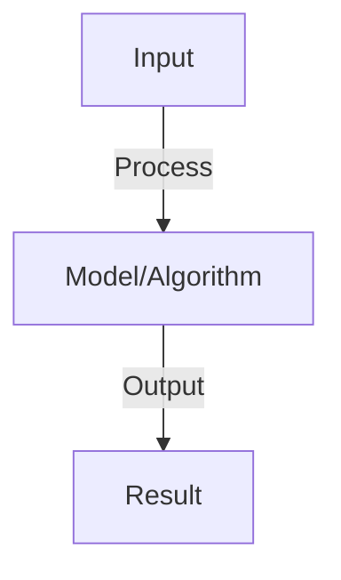
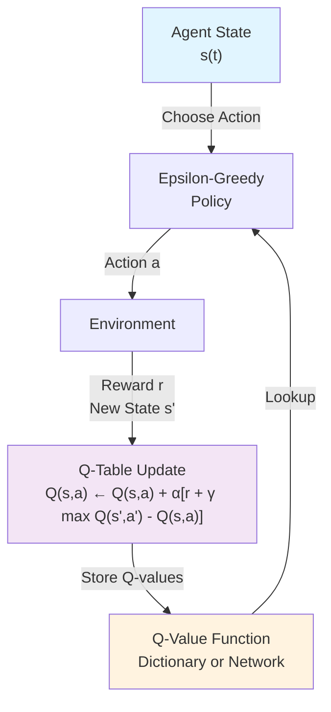
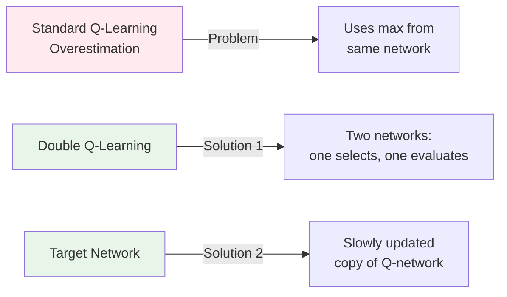

# Q-Learning

## Detailed Explanation

Q-Learning is a foundational off-policy RL algorithm that learns optimal decision-making by estimating Q-values: expected cumulative reward for taking action a in state s. The algorithm is simple but powerful: repeatedly take action, observe reward and next state, update Q(s,a) ← Q(s,a) + α[r + γ max Q(s',a') - Q(s,a)], then repeat. Off-policy means it learns the optimal policy while following a different exploratory policy, making it sample-efficient.

The core insight is that Q-values can be learned iteratively: the value of a state-action pair improves by comparing actual return (immediate reward + discounted future value) with current estimate, then moving toward the better estimate. Exploration-exploitation trade-off is managed with ε-greedy: explore with probability ε, exploit with probability 1-ε. Deep Q-Networks (DQN) use neural networks as function approximators for large state spaces, combined with experience replay (storing and sampling past experiences) and target networks (slowly updated copies) for stability.

Q-Learning is crucial to understand because it bridges simple models and deep RL. The algorithm introduces concepts (value iteration, off-policy learning, temporal difference learning) that appear throughout modern RL. Limitations include overestimation bias (which Double Q-Learning addresses) and difficulty with continuous action spaces. Most modern practical RL uses variants or alternatives, but Q-Learning concepts remain fundamental.

## Core Intuition

Q-Learning is like learning which chess moves are good by playing repeatedly: estimate value of each (position, move) pair, try moves, see results, update estimates toward observed outcomes. The value estimate improves by bootstrapping: using estimated values of future positions to improve current estimates. It's learning value through iterative comparison of expectations vs. reality.

## How It Works

1. Q(s,a): action value function, expected cumulative reward from state s taking action a
2. Q-learning update: Q(s,a) ← Q(s,a) + α[r + γ max Q(s',a') - Q(s,a)]
3. Components: r (immediate reward), γ (discount factor), α (learning rate)
4. Exploration: ε-greedy (explore with probability ε, exploit otherwise)
5. Convergence: with sufficient exploration and learning rate decay, converges to optimal Q*
6. Deep Q-Network (DQN): use neural network to approximate Q (handles large state space)
7. Improvements: target networks (stability), experience replay (decorrelate samples), dueling networks

## Architecture / Trade-offs

### Core Architecture

### Off-Policy vs On-Policy

| Aspect | Q-Learning (Off-Policy) | REINFORCE (On-Policy) |
|--------|-------------------------|----------------------|
| **What learns** | Optimal policy Q* | Current policy π |
| **Sample efficiency** | High (learn from any trajectory) | Low (must learn from current policy) |
| **Stability** | Overestimation bias | More stable |
| **Implementation** | Simpler | More complex |
| **Convergence** | Guaranteed with conditions | Convergent but slower |
| **Use case** | Learning from diverse experience | Immediate policy improvement |

### Tabular vs Function Approximation

| Approach | Tabular Q-Learning | Deep Q-Network (DQN) |
|----------|-------------------|----------------------|
| **State space** | Small, discrete | Large, continuous |
| **Memory** | O(|S| × |A|) | O(network parameters) |
| **Scalability** | Limited to small domains | Scales to complex domains |
| **Convergence** | Guaranteed | Not guaranteed |
| **Generalization** | No generalization | Generalizes across similar states |
| **Stability** | Inherently stable | Requires tricks (target network, replay buffer) |
| **Best for** | Toy problems, simple games | Atari, robotics, real-world tasks |

### Key Design Trade-offs

**Exploration Rate (ε)**
- High ε (0.5+): More exploration, slower convergence, discovers rare good actions
- Low ε (0.01): Fast convergence, may get stuck in local optima
- Decay ε over time: Best approach, explore early, exploit later

**Learning Rate (α)**
- High α (0.5+): Fast learning, unstable, overshoots optima
- Low α (0.01): Slow learning, stable, requires many iterations
- Optimal: Decay α over time or use adaptive methods (decreasing with update count)

**Discount Factor (γ)**
- γ close to 0: Myopic, only cares about immediate reward
- γ close to 1: Long-term planning, slower convergence, can be unstable
- Typical: 0.9-0.99 for most problems

### Addressing Overestimation

## Interview Q&A

**Q: Why is Q-learning off-policy?**
A: Off-policy: learns optimal policy while following exploratory policy (ε-greedy). Can learn from trajectories generated by any policy. Compare to on-policy (REINFORCE): must learn from current policy. Off-policy more sample-efficient.

**Q: What is the exploration-exploitation tradeoff in Q-learning?**
A: Exploration: try new actions to find better ones (needed to learn). Exploitation: use best known action. ε-greedy balances: explore ε fraction of time, exploit (1-ε) fraction. Decay ε over time (explore more early, exploit more late).

**Q: How do you prevent overestimation in Q-learning?**
A: Problem: max operation in Q-update uses same network (overestimates). Solution: Double Q-learning uses separate network for selection vs. evaluation. Or: target network (slowly updated copy of Q-network). Both reduce overestimation bias.

**Q: Can Q-learning handle continuous action spaces?**
A: Discrete only in basic form (output Q-value per action). Continuous: use actor-critic or policy gradient instead (output action directly). Or: discretize action space (approximate continuous with discrete).

**Q: How do you know Q-learning has converged?**
A: Monitor: average reward per episode (should increase). Q-values: should stabilize (stop changing). Learning curves: plot performance vs episodes, look for plateau. Testing: evaluate learned policy on held-out tasks.

## Best Practices

- Apply best practices specific to this concept
- Consider edge cases and failure modes
- Test on representative data
- Evaluate comprehensively

## Common Pitfalls

- Avoid over-simplification
- Watch for incorrect assumptions
- Test edge cases thoroughly
- Monitor for degradation

## Code Examples

See the associated notebook for implementation and real-world examples.

## Related Concepts

- Understand prerequisites first
- Connect related topics
- Build integrated knowledge
