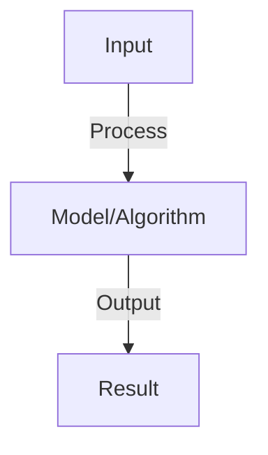

# Policy Gradients

## Detailed Explanation

Directly optimize the policy by taking gradient steps to maximize expected reward

## Core Intuition

Directly optimize the policy by taking gradient steps to maximize expected reward Understanding this concept enables better system design and problem-solving.

## How It Works

1. Policy π(a|s): stochastic policy mapping states to action probabilities
2. Objective: maximize J(θ) = E[sum discounted rewards]
3. Policy gradient: ∇J(θ) = E[∇log π(a|s) × R(τ)]
4. REINFORCE: sample trajectory, compute gradients, update policy
5. Baseline: subtract baseline from reward to reduce variance (doesn't bias gradient)
6. Advantage: use advantage A(s,a) = Q(s,a) - V(s) instead of reward (lower variance)
7. Variants: PPO (clipped objective), TRPO (trust region), A3C (asynchronous)

## Architecture / Trade-offs

Key trade-offs and design considerations for this concept.

## Interview Q&A

**Q: How do policy gradients differ from Q-learning?**
A: Q-learning: learn value function implicitly (derive policy by max). Policy gradient: directly optimize policy. Tradeoff: PG converges slower but to better optima, handles continuous actions naturally. Both have merits.

**Q: What is the baseline in policy gradients and why use it?**
A: Baseline: subtract moving average of returns from reward. Reduces variance (if return is 10 and baseline is 8, advantage is 2). Doesn't bias gradient (expected value still same). Critical for stable training.

**Q: What's the difference between REINFORCE and A3C?**
A: REINFORCE: accumulate trajectory, update once (on-policy). A3C: asynchronous (multiple workers), update frequently. A3C: faster (parallel) but more complex. REINFORCE: simpler but slower. Use REINFORCE for learning, A3C for scaling.

**Q: How do you handle high-variance policy gradients?**
A: Sources: rewards are noisy, variance grows with horizon. Solutions: (1) baseline (reduce magnitude), (2) advantage (relative comparison), (3) batch/normalization (average over samples), (4) trust regions (limit step size).

**Q: Can policy gradients handle discrete and continuous actions?**
A: Discrete: softmax over actions (same as classification). Continuous: output mean + variance of action distribution (Gaussian), sample from it. Much more natural for continuous than Q-learning (which requires discretization).

## Best Practices

- Apply best practices specific to this concept
- Consider edge cases and failure modes
- Test on representative data
- Evaluate comprehensively

## Common Pitfalls

- Avoid over-simplification
- Watch for incorrect assumptions
- Test edge cases thoroughly
- Monitor for degradation

## Code Examples

See the associated notebook for implementation and real-world examples.

## Related Concepts

- Understand prerequisites first
- Connect related topics
- Build integrated knowledge
