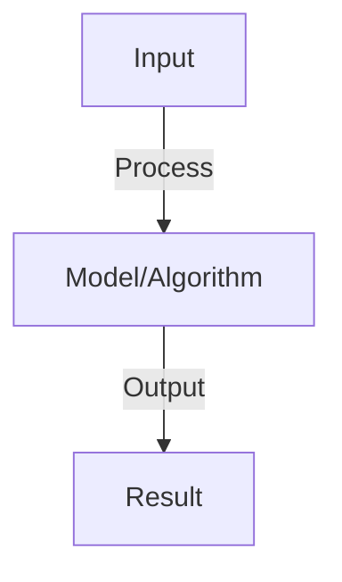
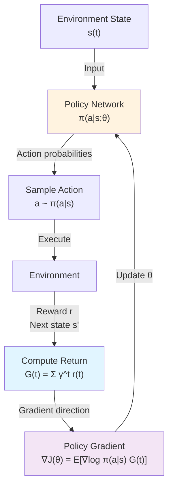
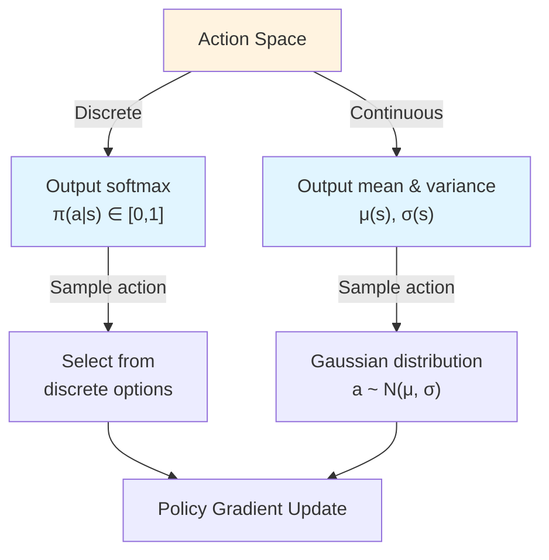

# Policy Gradients

## Detailed Explanation

Policy Gradient methods directly optimize the policy (probability distribution over actions) by computing gradients with respect to policy parameters. Rather than learning value functions then deriving policies (value-based RL), policy-gradient methods directly improve the policy. The core idea: compute how policy parameters affect expected return, then take steps to increase that return. REINFORCE is the simplest algorithm: sample trajectories, compute returns, scale policy gradients by returns.

Policy gradients handle continuous action spaces naturally (policy outputs action probabilities or mean/variance of action distribution), unlike Q-Learning which requires discrete actions or complex approximations. Variance is high (samples are noisy) so variance reduction techniques are crucial: baselines subtract an estimate of value (reduces variance without changing gradient), advantage functions estimate how much better an action is than average. Actor-Critic methods combine policy gradients (actor: which action to take) with value functions (critic: how good is this state).

Policy gradients form the foundation of modern RL: Proximal Policy Optimization (PPO), Trust Region Policy Optimization (TRPO), and others. Understanding the policy gradient theorem (gradient of expected return = expected gradient of return) is important for understanding the landscape. Limitations include high variance (needs many samples) and local optima (hill-climbing in policy space). Modern methods add techniques like entropy regularization (encourages exploration) and clipped policy updates for stability.

## Core Intuition

Policy gradients are like tweaking a recipe based on how good the food turns out: if dish tastes good, increase likelihood of parameters that led to it; if bad, decrease likelihood. It's directly improving the decision-making strategy (policy) based on observed outcomes, not learning values.

## How It Works

1. Policy π(a|s): stochastic policy mapping states to action probabilities
2. Objective: maximize J(θ) = E[sum discounted rewards]
3. Policy gradient: ∇J(θ) = E[∇log π(a|s) × R(τ)]
4. REINFORCE: sample trajectory, compute gradients, update policy
5. Baseline: subtract baseline from reward to reduce variance (doesn't bias gradient)
6. Advantage: use advantage A(s,a) = Q(s,a) - V(s) instead of reward (lower variance)
7. Variants: PPO (clipped objective), TRPO (trust region), A3C (asynchronous)

## Architecture / Trade-offs

### Core Architecture

### Policy Gradient Variants

| Method | Baseline | Variance | Bias | Convergence |
|--------|----------|----------|------|-------------|
| **REINFORCE** | None | Very High | Unbiased | Slow |
| **REINFORCE w/ Baseline** | State value | High | Unbiased | Medium |
| **Actor-Critic** | Critic network | Low | Biased | Fast |
| **A3C** | Advantage function | Low | Slight bias | Very Fast |
| **PPO** | Clipped advantage | Low | Slight bias | Stable |

### Continuous vs Discrete Actions

### Variance Reduction Techniques

| Technique | Impact on Variance | Impact on Bias | Cost |
|-----------|-------------------|-----------------|------|
| Baseline subtraction | Moderate reduction | None (unbiased) | Minimal |
| Advantage estimation | Good reduction | Slight increase | Moderate |
| Generalized Advantage Estimation (GAE) | Very good | Very slight | Moderate |
| Multiple steps (n-step returns) | Good | Small increase | Moderate |

### Trade-off: Sample Efficiency vs Stability

**On-Policy (REINFORCE family)**
- ✓ Unbiased gradient estimates
- ✓ Guaranteed convergence to local optima
- ✗ High variance (need many samples)
- ✗ Sample inefficient

**Off-Policy (Deterministic Policy Gradient)**
- ✓ Better sample efficiency
- ✗ Biased gradient estimates
- ✗ Convergence not guaranteed
- ✓ More stable training
## Interview Q&A

**Q: How do policy gradients differ from Q-learning?**
A: Q-learning: learn value function implicitly (derive policy by max). Policy gradient: directly optimize policy. Tradeoff: PG converges slower but to better optima, handles continuous actions naturally. Both have merits.

**Q: What is the baseline in policy gradients and why use it?**
A: Baseline: subtract moving average of returns from reward. Reduces variance (if return is 10 and baseline is 8, advantage is 2). Doesn't bias gradient (expected value still same). Critical for stable training.

**Q: What's the difference between REINFORCE and A3C?**
A: REINFORCE: accumulate trajectory, update once (on-policy). A3C: asynchronous (multiple workers), update frequently. A3C: faster (parallel) but more complex. REINFORCE: simpler but slower. Use REINFORCE for learning, A3C for scaling.

**Q: How do you handle high-variance policy gradients?**
A: Sources: rewards are noisy, variance grows with horizon. Solutions: (1) baseline (reduce magnitude), (2) advantage (relative comparison), (3) batch/normalization (average over samples), (4) trust regions (limit step size).

**Q: Can policy gradients handle discrete and continuous actions?**
A: Discrete: softmax over actions (same as classification). Continuous: output mean + variance of action distribution (Gaussian), sample from it. Much more natural for continuous than Q-learning (which requires discretization).

## Best Practices

- Apply best practices specific to this concept
- Consider edge cases and failure modes
- Test on representative data
- Evaluate comprehensively

## Common Pitfalls

- Avoid over-simplification
- Watch for incorrect assumptions
- Test edge cases thoroughly
- Monitor for degradation

## Code Examples

See the associated notebook for implementation and real-world examples.

## Related Concepts

- Understand prerequisites first
- Connect related topics
- Build integrated knowledge
