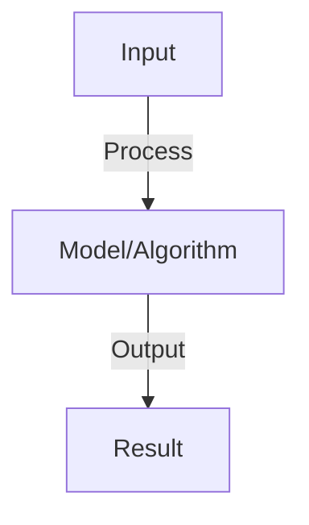
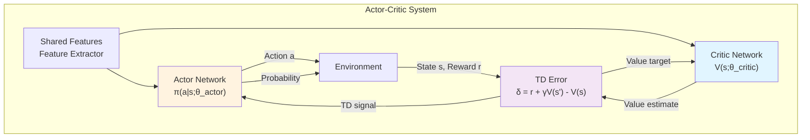
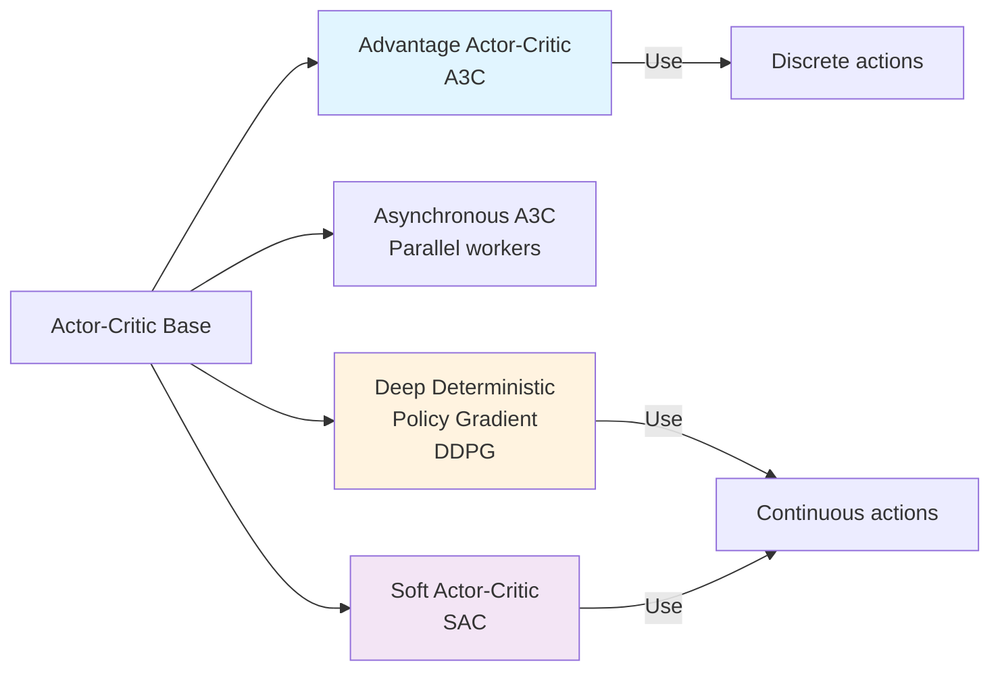

# Actor-Critic Methods

## Detailed Explanation

Actor-Critic methods combine two neural networks: an actor that learns the policy (which actions to take) and a critic that learns the value function (how good a state is). This hybrid approach leverages the strengths of both policy gradient and value-based methods while addressing their individual weaknesses.

The actor uses policy gradients to improve the policy, but instead of using the full episode return as the reward signal, it uses the critic's value estimate, which significantly reduces variance in gradient estimates. The critic learns to accurately estimate state values using temporal difference learning, providing low-variance training signals to the actor. This mutual improvement creates a powerful learning dynamic: the critic provides better training signal to the actor, while the actor's improved policy helps the critic learn better value estimates.

Actor-Critic methods are fundamental to modern deep reinforcement learning (A3C, PPO, TRPO) and excel at both discrete and continuous control. They balance the stability of value methods with the flexibility of policy gradients. Understanding actor-critic is essential because it demonstrates how neural networks can simultaneously solve multiple related problems and how bootstrapping (using value estimates as targets) enables efficient learning in continuous domains.

## Core Intuition

The actor is the decision-maker (policy), choosing which actions to take based on learned experience. The critic is the evaluator, estimating how good each state is. The critic tells the actor 'that action led to a better outcome than expected' (or worse), helping the actor learn faster. Together, they're like a student and teacher: the student learns actions, the teacher provides feedback.

## How It Works

1. Actor: policy network π(a|s), generates actions
2. Critic: value network V(s), estimates state value
3. Advantage: A(s,a) = r + γV(s') - V(s) (estimated using critic)
4. Actor loss: -log π(a|s) × A(s,a) (improve policy using critic's estimate)
5. Critic loss: MSE(V(s), target) where target = r + γV(s') (bootstrap from next state)
6. Update: compute both losses, backprop to both networks
7. Benefits: lower variance (critic baseline), more stable (two networks)



## Architecture / Trade-offs

### Two-Network Architecture



### Actor vs Critic Responsibilities

| Component | Actor | Critic |
|-----------|-------|--------|
| **What it learns** | Policy π(a\|s) | Value function V(s) |
| **Output** | Action probabilities/means | Scalar value |
| **Loss function** | Policy gradient × TD error | TD loss (V(s) - target)² |
| **Training signal** | Critic's TD error | Ground truth return |
| **Role** | Decides what to do | Evaluates how good decision is |
| **Failure mode** | Policies underexplore | Overestimates/underestimates values |

### Architecture Variants



### Bias-Variance Trade-off

| Aspect | Lower Bias (Critic) | Higher Bias (Advantage) |
|--------|-------------------|------------------------|
| **TD Target** | Full episode return (unbiased) | Critic prediction (biased) |
| **Variance** | High (entire episode affects gradient) | Low (critic reduces noise) |
| **Convergence speed** | Slow | Fast |
| **When to use** | Small variance in environment | Complex tasks with noise |
| **Stability** | More stable | Less stable |

### Multi-Step Learning

```mermaid
graph TD
    A["One-Step TD"] -->|δ = r + γV(s')| B["Low bias, High variance<br/>Fast learning, Unstable"]
    A -->|n-Step| C["n-Step TD<br/>δ = r + γr' + ... + γ^n V(s_n)"]
    A -->|∞-Step| D["Monte Carlo<br/>Use full return"]
    C -->|Balanced| E["Good trade-off<br/>n=3 or 4 typical"]

    style B fill:#fff3e0
    style E fill:#e1f5ff
    style D fill:#f3e5f5
```

### Trade-offs: Synchronous vs Asynchronous

| Property | Synchronous A3C | Asynchronous A3C |
|----------|-----------------|------------------|
| **Training** | Single worker, sequential | Multiple workers, parallel |
| **Convergence speed** | Slower | Faster (more samples) |
| **Complexity** | Simple | Complex (threading, locking) |
| **Hardware** | Single machine | Multi-core/GPU |
| **Stability** | Less stable | More stable (diverse experience) |
| **Memory** | Lower | Higher (multiple workers) |
## Interview Q&A


**Q: Why is actor-critic better than pure policy gradient?**
A: Pure PG: high variance (rewards are noisy). Actor-critic: critic provides baseline (reduces variance). Result: faster convergence, more stable training. Trade-off: slightly more complex (two networks).

**Q: What is TD error and how is it used?**
A: TD error: δ = r + γV(s') - V(s). Actor: use as advantage (update policy in gradient direction of advantage). Critic: update V(s) to minimize TD error. Both use same TD signal (efficient).

**Q: How do you avoid instability in actor-critic?**
A: Sources: two networks learning simultaneously (instability), high variance from policy gradients. Solutions: (1) target critic network (slowly updated copy), (2) experience replay (decorrelate samples), (3) entropy regularization (encourage exploration).

**Q: What is asynchronous advantage actor-critic (A3C)?**
A: A3C: multiple workers run episodes in parallel, asynchronously update shared networks. Benefits: more diverse experience, faster training. Implementation: careful synchronization (locks, atomic operations). Good for distributed systems.

**Q: Can you use actor-critic for continuous control?**
A: Yes, naturally: actor outputs mean+variance of action distribution. Critic estimates value. Works for both discrete and continuous. Popular in robotics (DDPG, TD3, SAC variants). Better than Q-learning for continuous actions.


## Best Practices

- Apply best practices specific to this concept
- Consider edge cases and failure modes
- Test on representative data
- Evaluate comprehensively

## Common Pitfalls

- Avoid over-simplification
- Watch for incorrect assumptions
- Test edge cases thoroughly
- Monitor for degradation

## Code Examples

See the associated notebook for implementation and real-world examples.

## Related Concepts

- Understand prerequisites first
- Connect related topics
- Build integrated knowledge
