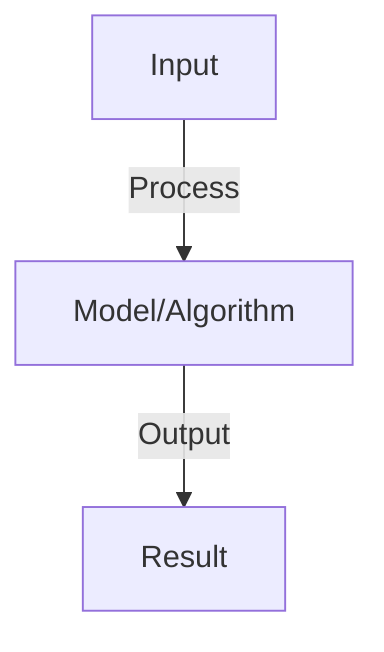

# Actor-Critic Methods

## Detailed Explanation

Combine policy gradient (actor) and value function (critic) for stable and sample-efficient learning

## Core Intuition

Combine policy gradient (actor) and value function (critic) for stable and sample-efficient learning Understanding this concept enables better system design and problem-solving.

## How It Works

1. Actor: policy network π(a|s), generates actions
2. Critic: value network V(s), estimates state value
3. Advantage: A(s,a) = r + γV(s') - V(s) (estimated using critic)
4. Actor loss: -log π(a|s) × A(s,a) (improve policy using critic's estimate)
5. Critic loss: MSE(V(s), target) where target = r + γV(s') (bootstrap from next state)
6. Update: compute both losses, backprop to both networks
7. Benefits: lower variance (critic baseline), more stable (two networks)

## Architecture / Trade-offs

Key trade-offs and design considerations for this concept.

## Interview Q&A

**Q: Why is actor-critic better than pure policy gradient?**
A: Pure PG: high variance (rewards are noisy). Actor-critic: critic provides baseline (reduces variance). Result: faster convergence, more stable training. Trade-off: slightly more complex (two networks).

**Q: What is TD error and how is it used?**
A: TD error: δ = r + γV(s') - V(s). Actor: use as advantage (update policy in gradient direction of advantage). Critic: update V(s) to minimize TD error. Both use same TD signal (efficient).

**Q: How do you avoid instability in actor-critic?**
A: Sources: two networks learning simultaneously (instability), high variance from policy gradients. Solutions: (1) target critic network (slowly updated copy), (2) experience replay (decorrelate samples), (3) entropy regularization (encourage exploration).

**Q: What is asynchronous advantage actor-critic (A3C)?**
A: A3C: multiple workers run episodes in parallel, asynchronously update shared networks. Benefits: more diverse experience, faster training. Implementation: careful synchronization (locks, atomic operations). Good for distributed systems.

**Q: Can you use actor-critic for continuous control?**
A: Yes, naturally: actor outputs mean+variance of action distribution. Critic estimates value. Works for both discrete and continuous. Popular in robotics (DDPG, TD3, SAC variants). Better than Q-learning for continuous actions.

## Best Practices

- Apply best practices specific to this concept
- Consider edge cases and failure modes
- Test on representative data
- Evaluate comprehensively

## Common Pitfalls

- Avoid over-simplification
- Watch for incorrect assumptions
- Test edge cases thoroughly
- Monitor for degradation

## Code Examples

See the associated notebook for implementation and real-world examples.

## Related Concepts

- Understand prerequisites first
- Connect related topics
- Build integrated knowledge
