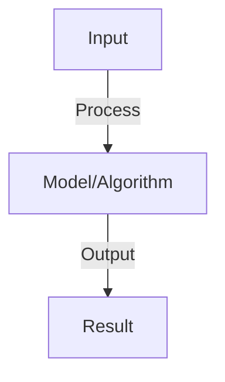

# Graph Neural Networks

## Detailed Explanation

Graph Neural Networks (GNNs) extend neural networks to data with graph structure—molecules, social networks, knowledge graphs, and recommendation systems. Traditional neural networks assume grid-like data (images) or sequences (text), but many real-world domains are naturally graphs where relationships between entities matter as much as the entities themselves.

GNNs learn by aggregating information from neighboring nodes, allowing each node's representation to incorporate both its features and the features of connected nodes. Through multiple layers of message passing, distant nodes can indirectly influence each other, enabling the network to capture long-range dependencies and structural patterns. The key innovation is permutation invariance: the network produces consistent results regardless of node ordering, naturally respecting the graph structure.

GNNs power recommendation systems (incorporating user-item interaction graphs), molecular property prediction (atoms as nodes, bonds as edges), knowledge base completion, and social network analysis. They're increasingly important because many real-world problems involve structured relationships that traditional neural networks miss. Understanding GNNs requires thinking beyond Euclidean space and embracing discrete structures, making it essential for anyone working on relational data or network-based problems.

## Core Intuition

Imagine nodes in a network where each node learns from its neighbors. A Twitter user's recommendation doesn't depend just on their own preferences, but also on what their friends like. GNNs work like information spreading through a network: each node receives messages from neighbors, updates its understanding, and passes updated messages forward. Repeat this a few times and each node understands not just local neighbors but the broader network structure.

## How It Works

1. Graph: nodes (entities) and edges (relationships)
2. Node features: each node has feature vector
3. Message passing: each node aggregates info from neighbors
4. Update: h_v^(t+1) = aggregate({h_u^(t) for u in neighbors(v)})
5. Readout: combine node embeddings into graph embedding
6. Tasks: node classification (predict node labels), graph classification, link prediction
7. Variants: GCN (convolutional), GAT (attention), GraphSAGE (sampling)

## Architecture / Trade-offs

Key trade-offs and design considerations for this concept.

## Interview Q&A

**Q: What's the difference between GCN and GraphSAGE?**
A: GCN: deterministic (aggregate all neighbors). GraphSAGE: sample subset of neighbors (scalable to large graphs). GCN more accurate for small graphs, GraphSAGE faster for large graphs.

**Q: How do you handle very large graphs?**
A: Challenge: full GNN requires aggregating all neighbors (O(n²)). Solutions: (1) sampling (sample k neighbors instead of all), (2) layer-wise sampling (different k per layer), (3) cluster-based (partition graph, aggregate within clusters).

**Q: What is attention in graph networks (GAT)?**
A: GAT: each node learns importance weights for neighbors (attention weights). Flexible: different neighbors get different weights per layer. More expressive: can learn complex aggregation patterns. Slower: needs to compute weights.

**Q: How do you create node embeddings from graphs?**
A: Methods: (1) trained GNN (learn embeddings end-to-end), (2) random walk-based (DeepWalk, Node2Vec), (3) matrix factorization. For supervised: train GNN end-to-end. For unsupervised: random walk or matrix factorization.

**Q: Can you use GNNs for recommendation systems?**
A: Yes: users and items as nodes, interactions as edges. GNN learns user/item embeddings, predicts new links (recommendations). Benefits: captures collaborative filtering structure naturally. Popular: LightGCN, NGCF variants.

## Best Practices

- Apply best practices specific to this concept
- Consider edge cases and failure modes
- Test on representative data
- Evaluate comprehensively

## Common Pitfalls

- Avoid over-simplification
- Watch for incorrect assumptions
- Test edge cases thoroughly
- Monitor for degradation

## Code Examples

See the associated notebook for implementation and real-world examples.

## Related Concepts

- Understand prerequisites first
- Connect related topics
- Build integrated knowledge
