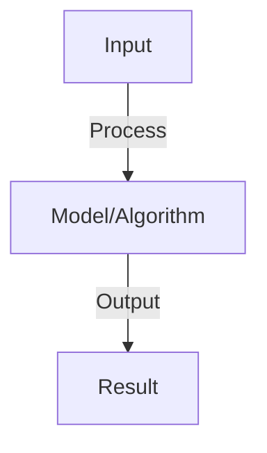
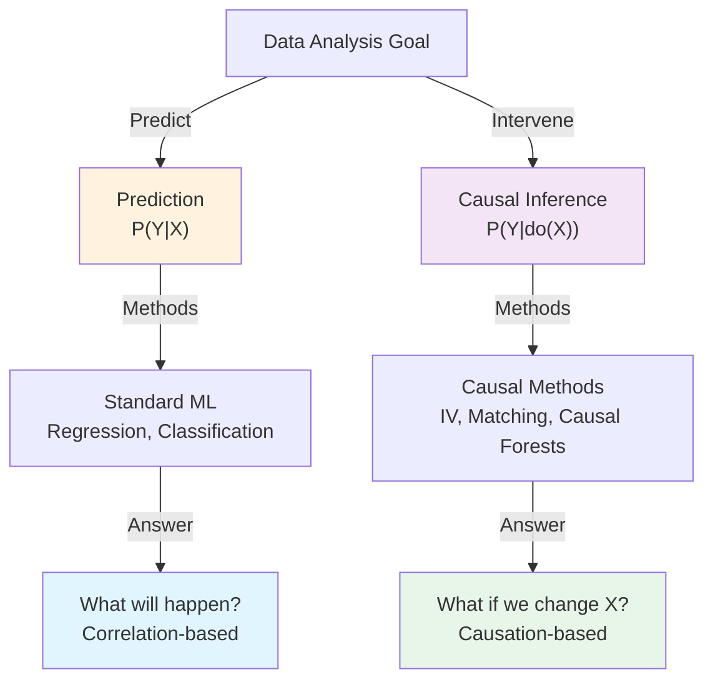
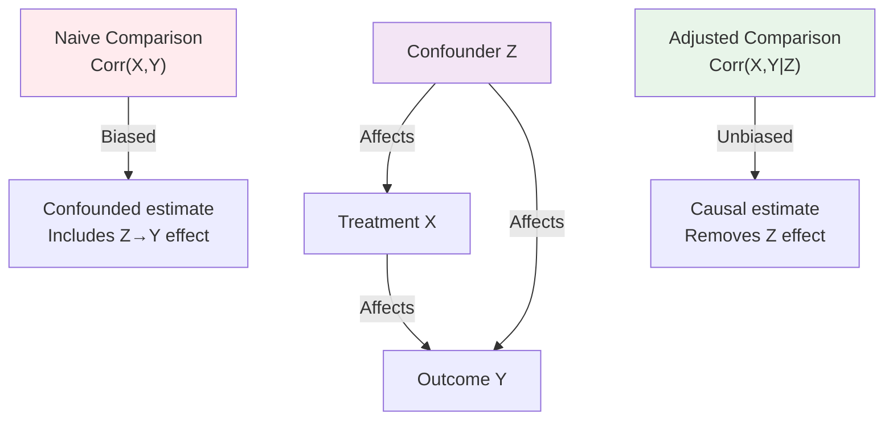
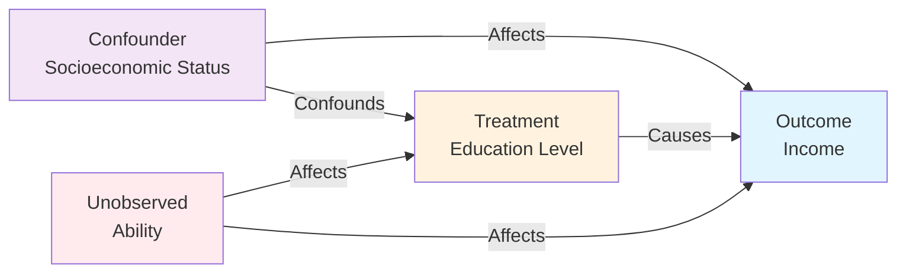

# Causal Inference

## Detailed Explanation

Causal inference is the science of determining cause-and-effect relationships from data, distinguishing between correlation and causation. While traditional machine learning predicts patterns, causal inference answers intervention questions: 'What happens if we change X?' rather than just 'What is X correlated with?' This distinction is crucial for decision-making in medicine, business, and policy.

Causal inference uses directed acyclic graphs (causal diagrams) to encode assumptions about how variables influence each other, then uses statistical techniques to estimate causal effects even from observational (non-experimental) data. Methods like propensity score matching, instrumental variables, and causal forests allow analysts to estimate the effect of an intervention on an outcome, accounting for confounding variables. The core insight is that randomized experiments automatically balance confounders, while observational data requires careful statistical control.

Causal reasoning is essential for any decisions beyond prediction: Should we deploy this model? How will this policy change affect outcomes? Does this correlation indicate a business opportunity? Understanding causality prevents costly mistakes from mistaking correlation for causation and enables principled decision-making under uncertainty. It's becoming increasingly important as organizations move from 'what will happen' (prediction) to 'what should we do' (decision-making).

## Core Intuition

Correlation means two things happen together; causation means one causes the other. Ice cream sales correlate with drowning deaths, but ice cream doesn't cause drowning—summer causes both. Causal inference is the detective work of determining which relationships are real causes. It uses data patterns and logical reasoning to answer 'if we change this variable, what actually changes as a result'.

## How It Works

1. Confounding: variable X affects both treatment T and outcome Y
2. DAG: directed acyclic graph showing causal structure
3. Adjustment: condition on confounders to isolate causal effect
4. Matching: match treated and control units on confounders
5. Propensity score: probability of treatment, use for matching or weighting
6. Instrumental variables: use variable that affects T but not Y (directly)
7. Difference-in-differences: compare treatment and control pre/post intervention

## Architecture / Trade-offs

### Causal vs Observational Reasoning

### Causal Identification Methods

| Method | Assumptions | Data Type | Bias |
|--------|-------------|-----------|------|
| **Randomized Experiment** | None (gold standard) | Experimental | Unbiased |
| **Propensity Score Matching** | Unconfoundedness | Observational | Biased if unobserved confounders |
| **Instrumental Variables** | Valid instrument exists | Observational | Unbiased (if valid) |
| **Regression Adjustment** | No hidden confounders | Observational | Biased if confounders missed |
| **Causal Forests** | Unconfoundedness | Observational | Unbiased under assumptions |
| **Synthetic Control** | Parallel trends | Panel data | Biased if assumption violated |

### Confounder Adjustment

### Methods Comparison

| Approach | Causal Assumption | Handles Hidden Confounders | Handles Feedback | Scalability |
|----------|-------------------|---------------------------|------------------|-------------|
| **Randomization** | No confounders (by design) | Yes | Yes | Limited |
| **Adjustment** | No hidden confounders | No | No | High |
| **Matching** | Unconfoundedness | No | No | Medium |
| **IV methods** | Instrument validity | Partial | No | Medium |
| **Causal Discovery** | None (learns from data) | Difficult | Can identify | High |

### Causal DAG Example

### Trade-offs: Strong Assumptions vs Flexibility

| Approach | Assumptions | Flexibility | Robustness |
|----------|-------------|-------------|-----------|
| **Randomization** | Very strict (need control group) | Low (fixed design) | Very high |
| **Causal Discovery** | Minimal (structure learning) | High (data-driven) | Low (can identify wrong structure) |
| **Domain Expert DAG** | Moderate (expert knowledge) | Moderate (expert-guided) | Depends on expertise |
| **Multiple Robustness Checks** | Weak (sensitivity testing) | Very high | High (if checks pass) |
## Interview Q&A

**Q: What's the difference between correlation and causation?**
A: Correlation: variables move together. Causation: one causes change in other. Confounder example: ice cream sales correlate with drowning (both caused by summer weather, no direct causation). Causal methods isolate true effect.

**Q: How do you estimate causal effects from observational data?**
A: Assumption: no unmeasured confounders (observe all variables affecting outcome). Methods: (1) adjustment (condition on confounders), (2) matching (match treated/control on confounders), (3) propensity score (weight by inverse probability of treatment). All assume no unmeasured confounding.

**Q: What is a confounder and how do you handle it?**
A: Confounder: affects both treatment and outcome. Bias: if not adjusted, confounders bias causal estimate. Handle: (1) randomization (best, breaks confounding), (2) adjustment (condition on confounder), (3) matching (match on confounder).

**Q: What are instrumental variables and when do you use them?**
A: IV: variable Z affects treatment T but doesn't directly affect outcome Y. Use when: confounders unmeasured, can't randomize. Example: rainfall affects irrigation (T), affects crops (Y) but not through other mechanisms. Enables causal inference under more assumptions.

**Q: How do you validate causal inferences?**
A: Sensitivity analysis: how robust to unmeasured confounding? Placebo tests: effect on variables that shouldn't be affected. Heterogeneous effects: does effect differ by subgroup (should be consistent mechanism). Multiple methods: if all agree, confidence increases.

## Best Practices

- Apply best practices specific to this concept
- Consider edge cases and failure modes
- Test on representative data
- Evaluate comprehensively

## Common Pitfalls

- Avoid over-simplification
- Watch for incorrect assumptions
- Test edge cases thoroughly
- Monitor for degradation

## Code Examples

See the associated notebook for implementation and real-world examples.

## Related Concepts

- Understand prerequisites first
- Connect related topics
- Build integrated knowledge
