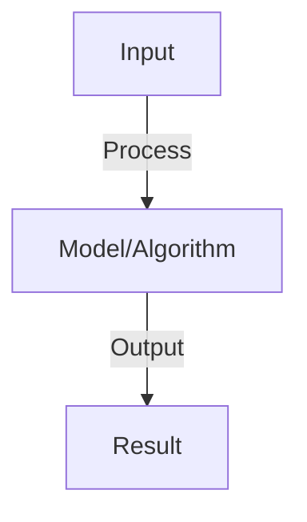

# Causal Inference

## Detailed Explanation

Learn causal relationships between variables, enabling prediction of interventions and counterfactuals

## Core Intuition

Learn causal relationships between variables, enabling prediction of interventions and counterfactuals Understanding this concept enables better system design and problem-solving.

## How It Works

1. Confounding: variable X affects both treatment T and outcome Y
2. DAG: directed acyclic graph showing causal structure
3. Adjustment: condition on confounders to isolate causal effect
4. Matching: match treated and control units on confounders
5. Propensity score: probability of treatment, use for matching or weighting
6. Instrumental variables: use variable that affects T but not Y (directly)
7. Difference-in-differences: compare treatment and control pre/post intervention

## Architecture / Trade-offs

Key trade-offs and design considerations for this concept.

## Interview Q&A

**Q: What's the difference between correlation and causation?**
A: Correlation: variables move together. Causation: one causes change in other. Confounder example: ice cream sales correlate with drowning (both caused by summer weather, no direct causation). Causal methods isolate true effect.

**Q: How do you estimate causal effects from observational data?**
A: Assumption: no unmeasured confounders (observe all variables affecting outcome). Methods: (1) adjustment (condition on confounders), (2) matching (match treated/control on confounders), (3) propensity score (weight by inverse probability of treatment). All assume no unmeasured confounding.

**Q: What is a confounder and how do you handle it?**
A: Confounder: affects both treatment and outcome. Bias: if not adjusted, confounders bias causal estimate. Handle: (1) randomization (best, breaks confounding), (2) adjustment (condition on confounder), (3) matching (match on confounder).

**Q: What are instrumental variables and when do you use them?**
A: IV: variable Z affects treatment T but doesn't directly affect outcome Y. Use when: confounders unmeasured, can't randomize. Example: rainfall affects irrigation (T), affects crops (Y) but not through other mechanisms. Enables causal inference under more assumptions.

**Q: How do you validate causal inferences?**
A: Sensitivity analysis: how robust to unmeasured confounding? Placebo tests: effect on variables that shouldn't be affected. Heterogeneous effects: does effect differ by subgroup (should be consistent mechanism). Multiple methods: if all agree, confidence increases.

## Best Practices

- Apply best practices specific to this concept
- Consider edge cases and failure modes
- Test on representative data
- Evaluate comprehensively

## Common Pitfalls

- Avoid over-simplification
- Watch for incorrect assumptions
- Test edge cases thoroughly
- Monitor for degradation

## Code Examples

See the associated notebook for implementation and real-world examples.

## Related Concepts

- Understand prerequisites first
- Connect related topics
- Build integrated knowledge
