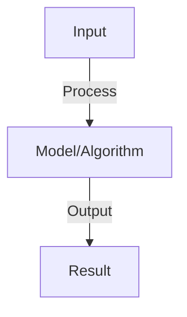

# Probabilistic Graphical Models

## Detailed Explanation

Represent complex probability distributions using graphs where nodes are variables and edges show dependencies

## Core Intuition

Represent complex probability distributions using graphs where nodes are variables and edges show dependencies Understanding this concept enables better system design and problem-solving.

## How It Works

1. Bayesian network: DAG where edges show causal/conditional dependencies
2. Joint probability: factorizes as product of conditional probabilities
3. Markov random field: undirected graph, factors are clique potentials
4. Inference: compute P(X|observations) using message passing (belief propagation)
5. Learning: learn structure (which edges) and parameters (conditional probabilities)
6. Applications: medical diagnosis (Bayesian nets), image segmentation (MRF)
7. Sampling: generate samples from distribution (Markov chain Monte Carlo)

## Architecture / Trade-offs

Key trade-offs and design considerations for this concept.

## Interview Q&A

**Q: What's the difference between Bayesian networks and Markov random fields?**
A: Bayesian: directed acyclic graph (DAG), edges show causality. MRF: undirected, shows correlations (no causal direction). Expressive: MRF slightly more (can represent cycles), Bayesian easier to interpret (causal structure clear).

**Q: How do you perform inference in graphical models?**
A: Exact: message passing (belief propagation), works for trees and small graphs. Approximate: Markov chain Monte Carlo (sampling), variational inference (optimize lower bound). Choose: exact for small models, approximate for large.

**Q: How do you learn structure of a graphical model?**
A: Known structure: learn parameters (maximize likelihood). Unknown: learn structure from data (NP-hard). Methods: greedy search (add/remove edges), constraint-based (find edges consistent with independencies), score-based (BIC/AIC).

**Q: What is a factor in Markov random fields?**
A: Factor: potential function over clique (subset of variables). Encodes preference for certain value combinations. Larger factors = more expressive but harder to compute. Factorization enables efficient inference via message passing.

**Q: Can you combine graphical models with deep learning?**
A: Yes: replace explicit factors with learned functions (neural networks). Example: neural CRF (conditional random field with neural potential). Benefits: learns features automatically. Challenges: may lose interpretability.

## Best Practices

- Apply best practices specific to this concept
- Consider edge cases and failure modes
- Test on representative data
- Evaluate comprehensively

## Common Pitfalls

- Avoid over-simplification
- Watch for incorrect assumptions
- Test edge cases thoroughly
- Monitor for degradation

## Code Examples

See the associated notebook for implementation and real-world examples.

## Related Concepts

- Understand prerequisites first
- Connect related topics
- Build integrated knowledge
