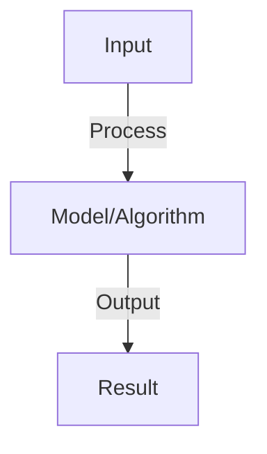
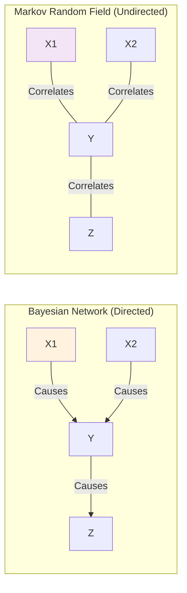
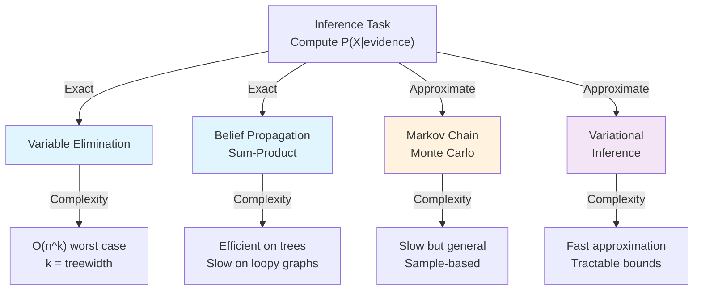
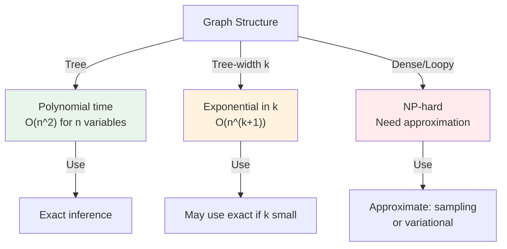

# Probabilistic Graphical Models

## Detailed Explanation

Probabilistic Graphical Models (PGMs) represent probability distributions using graph structure where nodes are random variables and edges encode conditional dependencies. They enable efficient reasoning about uncertainty in complex systems by exploiting conditional independence—the fact that some variables don't directly influence others given intermediate information.

Bayesian Networks (DAGs) encode causal or temporal relationships, while Markov Random Fields (undirected graphs) encode symmetric relationships. The graphical structure determines how we can decompose the joint probability distribution into tractable factors, enabling efficient inference even in high-dimensional problems. Algorithms like variable elimination and belief propagation use the graph structure to compute probabilities by passing messages rather than enumerating all possibilities.

PGMs are foundational because they make explicit the assumptions about how variables relate to each other, enabling principled probabilistic reasoning. They power applications from medical diagnosis (Bayesian Networks) to computer vision (Markov Random Fields). Understanding PGMs requires thinking about independence and factorization, and appreciates that many complex systems can be understood through structured conditional independence.

## Core Intuition

Think of a graph where each circle is a variable and edges show 'this variable affects this one'. By understanding these relationships, you can reason about what happens when you observe new information. If you learn it's raining, that explains why the grass is wet AND why the sidewalk is wet—but wet grass and wet sidewalk become less surprising to you once you know it's raining. The graph captures this: rain causes both, so they're dependent unless you condition on rain.

## How It Works

1. Bayesian network: DAG where edges show causal/conditional dependencies
2. Joint probability: factorizes as product of conditional probabilities
3. Markov random field: undirected graph, factors are clique potentials
4. Inference: compute P(X|observations) using message passing (belief propagation)
5. Learning: learn structure (which edges) and parameters (conditional probabilities)
6. Applications: medical diagnosis (Bayesian nets), image segmentation (MRF)
7. Sampling: generate samples from distribution (Markov chain Monte Carlo)

## Architecture / Trade-offs

### Directed vs Undirected Graphical Models

### Model Type Comparison

| Property | Bayesian Network | Markov Random Field |
|----------|-----------------|----------------------|
| **Graph type** | Directed Acyclic Graph | Undirected graph |
| **Semantics** | Causal/temporal | Symmetric correlations |
| **Factorization** | Conditional probabilities P(X_i\|Parents) | Potential functions φ(cliques) |
| **Inference** | Belief propagation, VE | Belief propagation, sampling |
| **When to use** | Causal relationships | Symmetric dependencies |
| **Example** | Medical diagnosis | Image segmentation |

### Inference Algorithms

### Parameter Learning Methods

| Method | Observability | Complexity | Assumptions |
|--------|---------------|-----------|-------------|
| **Maximum Likelihood (MLE)** | Fully observed | Easy | No missing data |
| **Expectation Maximization (EM)** | Partially observed | Medium | Convergence to local optimum |
| **Gradient Descent** | Any | Medium | Differentiable |
| **Gibbs Sampling** | Partially observed | Hard | MCMC mixing |
| **Variational EM** | Partially observed | Hard | Variational approximation quality |

### Complexity of Inference

### Model Selection Trade-offs

| Aspect | Simple Model | Complex Model |
|--------|--------------|----------------|
| **Structure** | Few edges, few parameters | Many edges, many parameters |
| **Interpretability** | High (easy to understand) | Low (hard to understand) |
| **Data requirements** | Low (fewer parameters) | High (risk overfitting) |
| **Inference speed** | Fast | Slow |
| **Modeling power** | Limited (may underfit) | High (may overfit) |
| **Overfitting risk** | Low | High |
| **Best for** | Small data, interpretability | Large data, accuracy |
## Interview Q&A

**Q: What's the difference between Bayesian networks and Markov random fields?**
A: Bayesian: directed acyclic graph (DAG), edges show causality. MRF: undirected, shows correlations (no causal direction). Expressive: MRF slightly more (can represent cycles), Bayesian easier to interpret (causal structure clear).

**Q: How do you perform inference in graphical models?**
A: Exact: message passing (belief propagation), works for trees and small graphs. Approximate: Markov chain Monte Carlo (sampling), variational inference (optimize lower bound). Choose: exact for small models, approximate for large.

**Q: How do you learn structure of a graphical model?**
A: Known structure: learn parameters (maximize likelihood). Unknown: learn structure from data (NP-hard). Methods: greedy search (add/remove edges), constraint-based (find edges consistent with independencies), score-based (BIC/AIC).

**Q: What is a factor in Markov random fields?**
A: Factor: potential function over clique (subset of variables). Encodes preference for certain value combinations. Larger factors = more expressive but harder to compute. Factorization enables efficient inference via message passing.

**Q: Can you combine graphical models with deep learning?**
A: Yes: replace explicit factors with learned functions (neural networks). Example: neural CRF (conditional random field with neural potential). Benefits: learns features automatically. Challenges: may lose interpretability.

## Best Practices

- Apply best practices specific to this concept
- Consider edge cases and failure modes
- Test on representative data
- Evaluate comprehensively

## Common Pitfalls

- Avoid over-simplification
- Watch for incorrect assumptions
- Test edge cases thoroughly
- Monitor for degradation

## Code Examples

See the associated notebook for implementation and real-world examples.

## Related Concepts

- Understand prerequisites first
- Connect related topics
- Build integrated knowledge
