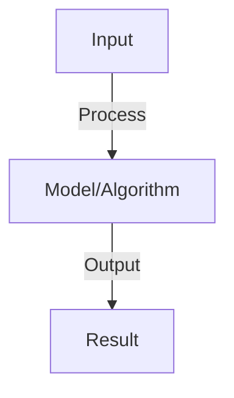

# Variational Autoencoders (VAE)

## Detailed Explanation

Generate new data and learn latent representations through variational inference

## Core Intuition

Generate new data and learn latent representations through variational inference Understanding this concept enables better system design and problem-solving.

## How It Works

1. Encoder: q(z|x) maps data to latent distribution
2. Latent: z sampled from N(μ, σ²) (Gaussian bottleneck)
3. Decoder: p(x|z) reconstructs data from latent
4. Loss: reconstruction loss + KL divergence (regularization)
5. KL: penalizes latent distribution from standard Gaussian (enables generation)
6. Training: reparameterization trick allows backprop through sampling
7. Generation: sample z from N(0,1), decode to get new data
8. Interpolation: interpolate in latent space (smooth transitions)

## Architecture / Trade-offs

Key trade-offs and design considerations for this concept.

## Interview Q&A

**Q: Why does VAE need both reconstruction and KL loss?**
A: Reconstruction: encoder-decoder learns to compress and reconstruct data. KL: forces latent to match prior (Gaussian), enables generation from prior. Together: learn good representations that are also generative.

**Q: What is the reparameterization trick and why is it needed?**
A: Trick: z = μ + σ*ε where ε ~ N(0,1). Enables: gradients flow through sampling (no gradients through sampling directly). Needed: backprop requires differentiable operations, sampling isn't. Trick makes it differentiable.

**Q: How is VAE different from a standard autoencoder?**
A: Standard: deterministic bottleneck, reconstructs but can't generate (no prior). VAE: probabilistic bottleneck, reconstructs and can generate (prior enables generation). VAE more useful for generation but may have lower reconstruction quality.

**Q: How do you control what VAE learns?**
A: Loss weights: balance reconstruction vs. KL (large KL → focus on generation, small → focus on reconstruction). Beta-VAE: multiply KL by β (β>1 emphasizes disentanglement). Adjust tradeoff based on task.

**Q: What is disentanglement in VAE?**
A: Disentanglement: each latent dimension corresponds to one semantic factor (size, color, rotation). Benefits: interpretability, controllable generation. Achieve: Beta-VAE or other regularization. Measure: how well can classifier predict factor from dimension?

## Best Practices

- Apply best practices specific to this concept
- Consider edge cases and failure modes
- Test on representative data
- Evaluate comprehensively

## Common Pitfalls

- Avoid over-simplification
- Watch for incorrect assumptions
- Test edge cases thoroughly
- Monitor for degradation

## Code Examples

See the associated notebook for implementation and real-world examples.

## Related Concepts

- Understand prerequisites first
- Connect related topics
- Build integrated knowledge
