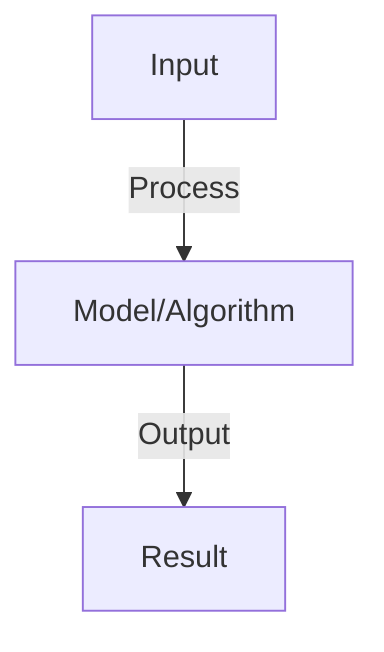

# Generative Adversarial Networks (GANs)

## Detailed Explanation

Train generator and discriminator in competition to generate realistic data from noise

## Core Intuition

Train generator and discriminator in competition to generate realistic data from noise Understanding this concept enables better system design and problem-solving.

## How It Works

1. Generator G: maps noise z to fake data G(z)
2. Discriminator D: classifies real vs. fake data
3. Game: G tries to fool D, D tries to detect fakes
4. Loss: D maximizes log(D(x)) + log(1-D(G(z)))
5. Generator loss: minimizes log(1-D(G(z))) (or max log(D(G(z))))
6. Training: alternate between D and G updates
7. Convergence: when D can't distinguish, G produces realistic data
8. Challenges: mode collapse (G produces same output), unstable training

## Architecture / Trade-offs

Key trade-offs and design considerations for this concept.

## Interview Q&A

**Q: Why is GAN training unstable?**
A: Reasons: (1) generator gradient vanishes when D confident, (2) discriminator overpowers generator, (3) mode collapse (generator ignores part of data). Fixes: (1) Wasserstein loss (better gradients), (2) spectral norm (stabilize D), (3) unrolled GAN (look ahead).

**Q: What is mode collapse and how do you prevent it?**
A: Mode collapse: generator produces same output despite different inputs (ignores diversity in data). Prevent: (1) minibatch discrimination (penalize similar minibatch samples), (2) feature matching (match statistics), (3) loss functions (WGAN, hinge).

**Q: How do you evaluate GAN quality?**
A: Inception score: generated sample quality (high = realistic). FID (Fréchet Inception Distance): distance between real and fake distributions (low = good). Manual evaluation: look at samples. Inception score easier but biased, FID more reliable.

**Q: What's the difference between GAN variants (WGAN, StyleGAN)?**
A: WGAN: Wasserstein distance instead of JS divergence, better gradients, more stable. StyleGAN: style-based architecture, fine control over generation (produce specific attributes). Both improve on vanilla GAN.

**Q: Can GANs be used for non-image tasks?**
A: Yes: text generation (SeqGAN), tabular data, audio, video. Challenge: GANs work best for continuous data (images), harder for discrete (text). Solutions: SeqGAN (approximate), or use other methods (VAE, diffusion) for discrete data.

## Best Practices

- Apply best practices specific to this concept
- Consider edge cases and failure modes
- Test on representative data
- Evaluate comprehensively

## Common Pitfalls

- Avoid over-simplification
- Watch for incorrect assumptions
- Test edge cases thoroughly
- Monitor for degradation

## Code Examples

See the associated notebook for implementation and real-world examples.

## Related Concepts

- Understand prerequisites first
- Connect related topics
- Build integrated knowledge
