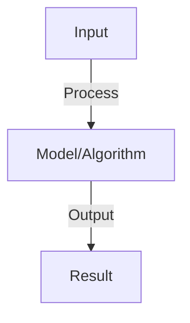
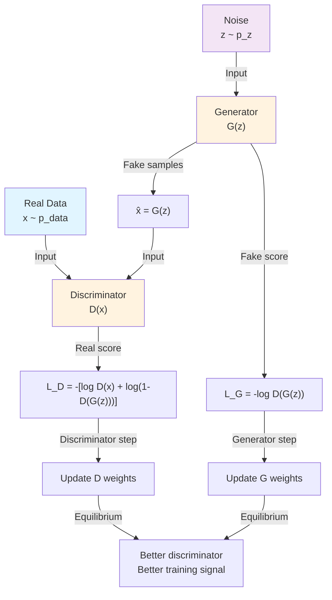
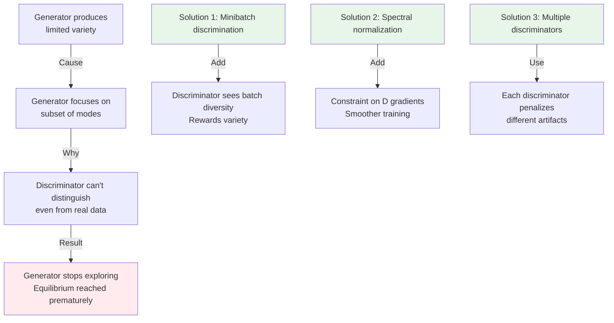
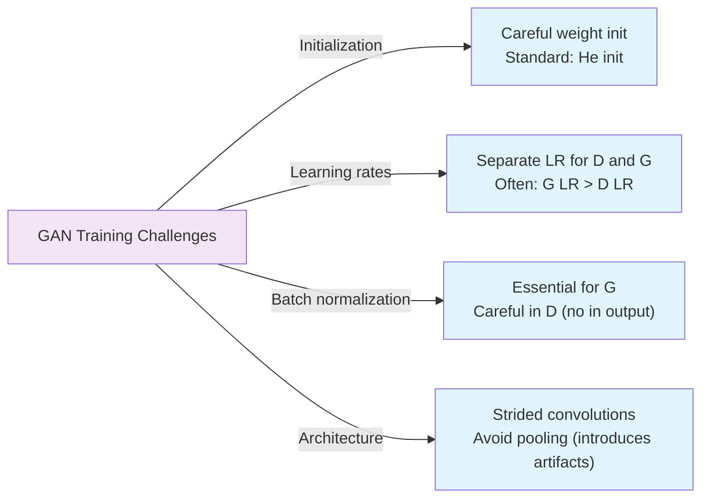

# Generative Adversarial Networks (GANs)

## Detailed Explanation

Generative Adversarial Networks (GANs) train two competing networks: generator (creates fake data trying to fool discriminator) and discriminator (tries to distinguish real from fake data). This adversarial process creates tension: as generator improves, discriminator must improve, creating positive feedback. The result: generator learns to create highly realistic data. GANs have created photorealistic images, style transfer, and data augmentation.

The training process is a two-player game: discriminator loss penalizes classifying real as real and fake as fake (wants correct classification); generator loss penalizes discriminator correctly classifying fake (generator wants to fool discriminator). At equilibrium, discriminator can't distinguish real from fake, so generator output is indistinguishable from real data. Training is unstable: generator collapses to single mode (ignores variation in real data), discriminator overpowers generator, or vice versa. Techniques stabilize training: spectral normalization, progressive growing (grow networks gradually), hinge loss alternatives.

GANs are powerful but notoriously difficult to train. The adversarial objective is elegant theoretically but unstable practically. Many variants address stability: Wasserstein GANs use better distance metrics; Conditional GANs add class labels; StyleGAN disentangles style from content. Understanding why GANs are unstable (generator has infinite capacity, training is min-max not minimum) helps appreciate engineering solutions. Applications beyond generation: discriminator representations for downstream tasks, feature learning, anomaly detection (real data has low discriminator loss). GANs represent a paradigm shift from explicit likelihood maximization to implicit distribution learning.

## Core Intuition

GANs are like art school: a forger (generator) creates fake paintings while an art critic (discriminator) learns to detect fakes. As the forger improves, the critic must improve, creating an arms race. Eventually, the forger creates paintings indistinguishable from real art. The competition drives quality.

## How It Works

1. Generator G: maps noise z to fake data G(z)
2. Discriminator D: classifies real vs. fake data
3. Game: G tries to fool D, D tries to detect fakes
4. Loss: D maximizes log(D(x)) + log(1-D(G(z)))
5. Generator loss: minimizes log(1-D(G(z))) (or max log(D(G(z))))
6. Training: alternate between D and G updates
7. Convergence: when D can't distinguish, G produces realistic data
8. Challenges: mode collapse (G produces same output), unstable training

## Architecture / Trade-offs

### GAN Training Loop

### GAN Variants Comparison

| Variant | Generator Loss | Stability | Training Speed | Quality |
|---------|----------------|-----------|-----------------|---------|
| **Standard GAN** | -log D(G(z)) | Low | Medium | Medium |
| **Least Squares GAN** | (D(G(z))-1)² | Medium | Medium | Good |
| **Wasserstein GAN** | -E[D(G(z))] | High | Slow | Very good |
| **Spectral Norm GAN** | Standard + Lipschitz constraint | High | Medium | Very good |
| **Progressive GAN** | Standard + progressive growth | High | Slow | Excellent |

### Mode Collapse Phenomenon

### Discriminator vs Generator Balance

| Aspect | Weak D | Balanced | Strong D |
|--------|--------|----------|----------|
| **Generator gradient** | Weak signal, slow learning | Good signal, fast learning | Saturated, no learning |
| **Fake sample quality** | Poor (no pressure) | Excellent | May collapse (all variations) |
| **Training stability** | Unstable, diverges | Stable | Unstable, mode collapse |
| **Convergence speed** | Slow | Optimal | Slow or fails |
| **How to fix** | Train D more | Nothing needed | Use better loss function |

### Training Tricks

### Evaluation Metrics Trade-offs

| Metric | Measures | Pros | Cons |
|--------|----------|------|------|
| **Inception Score (IS)** | Sample quality | Easy to compute | Biased toward IS-trained images |
| **Fréchet Inception Distance (FID)** | Distribution quality | Correlates with human judgment | Requires reference dataset |
| **Kernel Inception Distance (KID)** | Distribution quality | Less biased than FID | Slower to compute |
| **Precision/Recall** | Diversity vs quality | Disentangled metrics | Requires classifiers |
| **Human evaluation** | True quality | Ground truth | Expensive, subjective |
## Interview Q&A

**Q: Why is GAN training unstable?**
A: Reasons: (1) generator gradient vanishes when D confident, (2) discriminator overpowers generator, (3) mode collapse (generator ignores part of data). Fixes: (1) Wasserstein loss (better gradients), (2) spectral norm (stabilize D), (3) unrolled GAN (look ahead).

**Q: What is mode collapse and how do you prevent it?**
A: Mode collapse: generator produces same output despite different inputs (ignores diversity in data). Prevent: (1) minibatch discrimination (penalize similar minibatch samples), (2) feature matching (match statistics), (3) loss functions (WGAN, hinge).

**Q: How do you evaluate GAN quality?**
A: Inception score: generated sample quality (high = realistic). FID (Fréchet Inception Distance): distance between real and fake distributions (low = good). Manual evaluation: look at samples. Inception score easier but biased, FID more reliable.

**Q: What's the difference between GAN variants (WGAN, StyleGAN)?**
A: WGAN: Wasserstein distance instead of JS divergence, better gradients, more stable. StyleGAN: style-based architecture, fine control over generation (produce specific attributes). Both improve on vanilla GAN.

**Q: Can GANs be used for non-image tasks?**
A: Yes: text generation (SeqGAN), tabular data, audio, video. Challenge: GANs work best for continuous data (images), harder for discrete (text). Solutions: SeqGAN (approximate), or use other methods (VAE, diffusion) for discrete data.

## Best Practices

- Apply best practices specific to this concept
- Consider edge cases and failure modes
- Test on representative data
- Evaluate comprehensively

## Common Pitfalls

- Avoid over-simplification
- Watch for incorrect assumptions
- Test edge cases thoroughly
- Monitor for degradation

## Code Examples

See the associated notebook for implementation and real-world examples.

## Related Concepts

- Understand prerequisites first
- Connect related topics
- Build integrated knowledge
