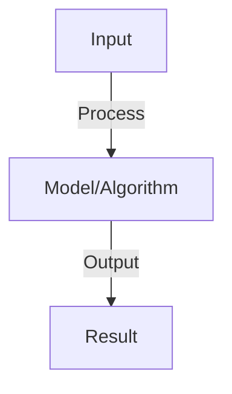

# Time Series Forecasting

## Detailed Explanation

Predict future values in sequential data based on past observations and temporal patterns

## Core Intuition

Predict future values in sequential data based on past observations and temporal patterns Understanding this concept enables better system design and problem-solving.

## How It Works

1. Autoregressive (AR): predict from past values y_t = β₀ + Σ βᵢ*y_{t-i} + ε
2. ARIMA: AR + moving average + differencing for non-stationary series
3. Exponential smoothing: weighted average of past (recent values weighted more)
4. RNNs/LSTMs: learn non-linear temporal patterns from sequence
5. Transformers: self-attention over time steps (captures long-range dependencies)
6. Multivariate: multiple input series predict output (e.g., weather → demand)
7. Evaluation: MSE on held-out future, track over time (performance may degrade)

## Architecture / Trade-offs

Key trade-offs and design considerations for this concept.

## Interview Q&A

**Q: When should you use ARIMA vs neural networks?**
A: ARIMA: stationary data, small datasets, interpretability important. Neural: non-linear patterns, large datasets, complex relationships. Hybrid: ARIMA for baseline, NN if ARIMA not good enough.

**Q: What is stationarity and why does it matter?**
A: Stationarity: statistical properties (mean, variance) constant over time. ARIMA assumes stationarity (if not, differencing). Non-stationary: trends, seasonality. Check: plots, statistical tests (ADF). Transform (log, diff) to achieve stationarity.

**Q: How do you handle seasonality in forecasting?**
A: Seasonality: repeating patterns (e.g., weekly, yearly). Model: (1) seasonal ARIMA (SARIMA), (2) include seasonal variables, (3) RNNs learn automatically. Challenge: long-range dependencies (annual seasonality = 365 steps).

**Q: What's the difference between one-step-ahead and multi-step forecasting?**
A: One-step: predict t+1 given up to t (easier). Multi-step: predict t+1, t+2, ..., t+h (harder, error accumulates). Approaches: recursive (use predictions), direct (separate models per step), sequence-to-sequence (encoder-decoder).

**Q: How do you evaluate forecasting models?**
A: Metrics: MAE (mean absolute error), RMSE (penalizes large errors), MAPE (relative error). Baseline: use last value or seasonal average. Compare: your model vs. baseline. Cross-validation: time-series CV (train on past, test on future).

## Best Practices

- Apply best practices specific to this concept
- Consider edge cases and failure modes
- Test on representative data
- Evaluate comprehensively

## Common Pitfalls

- Avoid over-simplification
- Watch for incorrect assumptions
- Test edge cases thoroughly
- Monitor for degradation

## Code Examples

See the associated notebook for implementation and real-world examples.

## Related Concepts

- Understand prerequisites first
- Connect related topics
- Build integrated knowledge
