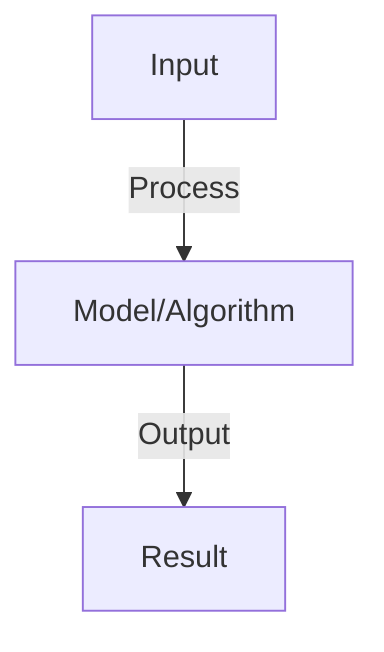
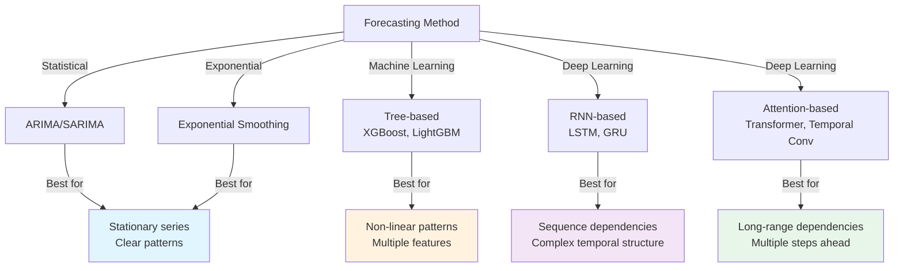
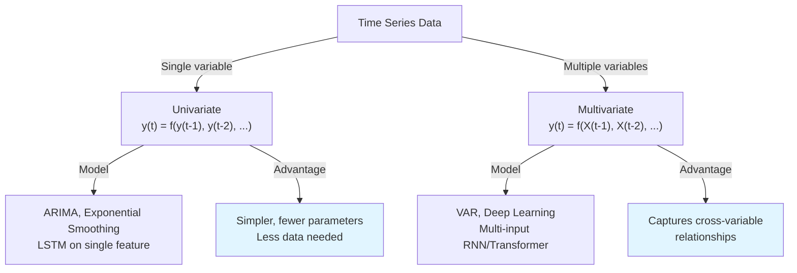
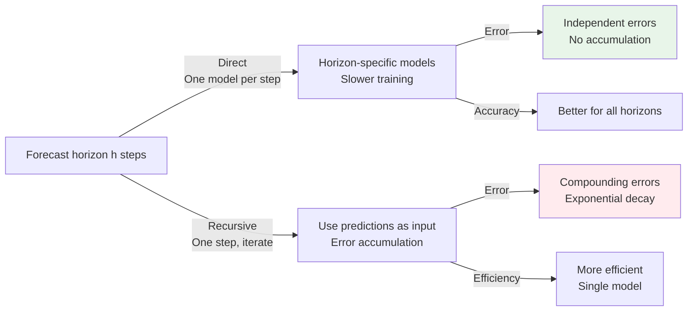

# Time Series Forecasting

## Detailed Explanation

Time Series Forecasting predicts future values given historical observations, crucial for planning and decision-making across finance, weather, demand. Time series have structure that standard models ignore: autocorrelation (values depend on recent history), seasonality (patterns repeat), trends (long-term direction). These patterns enable modeling and prediction but violate independence assumptions. Traditional methods (ARIMA, SARIMA, exponential smoothing) explicitly model these patterns; modern deep learning approaches (RNNs, Transformers) learn patterns implicitly.

Challenges are fundamental: future depends on factors not in historical data (sudden events, policy changes), distributions may change (non-stationary), high variance in nature (weather is inherently unpredictable). Model choices trade off: simple models (moving average, exponential smoothing) are interpretable, stable, but miss complex patterns; complex models (deep learning) capture patterns but need more data and careful validation. Walk-forward validation (train on past, test on recent, repeat) prevents overfitting to historical data. Probabilistic forecasting (predicting distributions not point estimates) quantifies uncertainty.

Time series forecasting is distinct from standard supervised learning: temporal structure matters, evaluation must respect time ordering, and fresh data continuously refutes old models. Understanding the limits of forecasting (some systems are inherently unpredictable) prevents over-confidence. Multivariate forecasting (multiple related series) adds complexity but enables leveraging relationships. Modern practical approaches combine statistical methods (handling known patterns) with deep learning (learning complex relationships), ensemble techniques (averaging predictions), and domain expertise (known seasonal adjustments).

## Core Intuition

Time series forecasting is like predicting weather: past patterns (seasons, trends) provide clues, but you can't predict everything (storms are surprising). Better predictions combine pattern recognition (summers are hot, winters cold) with understanding limits (perfect prediction is impossible). Recent history matters most, but very old patterns reveal long-term trends.

## How It Works

1. Autoregressive (AR): predict from past values y_t = β₀ + Σ βᵢ*y_{t-i} + ε
2. ARIMA: AR + moving average + differencing for non-stationary series
3. Exponential smoothing: weighted average of past (recent values weighted more)
4. RNNs/LSTMs: learn non-linear temporal patterns from sequence
5. Transformers: self-attention over time steps (captures long-range dependencies)
6. Multivariate: multiple input series predict output (e.g., weather → demand)
7. Evaluation: MSE on held-out future, track over time (performance may degrade)

## Architecture / Trade-offs

### Time Series Forecasting Approaches

### Model Complexity vs Data Requirements

| Model | Parameters | Data Needed | Interpretability | Training Speed |
|-------|-----------|------------|-----------------|-----------------|
| **Exponential Smoothing** | Few (2-3) | 10-20 observations | Very high | Very fast |
| **ARIMA** | Few (3-5) | 50-100+ observations | High | Fast |
| **Linear/Ridge Regression** | Medium | 100+ observations | High | Very fast |
| **Tree ensemble** | High (100-1000) | 500+ observations | Medium | Medium |
| **LSTM** | Very high (10K+) | 1000+ observations | Low | Slow |
| **Transformer** | Extreme (100K+) | 10K+ observations | Very low | Very slow |

### Univariate vs Multivariate

### Forecasting Horizons

| Horizon | Difficulty | Accuracy Decay | Method |
|---------|-----------|-----------------|---------|
| **1-step (nowcasting)** | Easy | Minimal | Any method works |
| **Short-term (1-7 steps)** | Medium | Gradual | Statistical or basic ML |
| **Medium-term (1-4 weeks)** | Hard | Significant | ML or deep learning |
| **Long-term (1-12 months)** | Very hard | Severe | External factors essential |
| **Multi-step ahead** | Hardest | Compounding error | Teacher forcing or ensemble |

### Error Accumulation: Direct vs Recursive

### Handling Non-stationarity

| Technique | Use When | Trade-off |
|-----------|----------|-----------|
| **Differencing** | Trend present | May lose information |
| **Detrending** | Linear trend | Assumes trend is linear |
| **Seasonal decomposition** | Seasonality evident | Assumes fixed seasonality |
| **Adaptive models** | Patterns change over time | More complex |
| **Online learning** | Streaming data | Need continuous updates |
| **Time window** | Recent data matters most | Loses historical patterns |
## Interview Q&A

**Q: When should you use ARIMA vs neural networks?**
A: ARIMA: stationary data, small datasets, interpretability important. Neural: non-linear patterns, large datasets, complex relationships. Hybrid: ARIMA for baseline, NN if ARIMA not good enough.

**Q: What is stationarity and why does it matter?**
A: Stationarity: statistical properties (mean, variance) constant over time. ARIMA assumes stationarity (if not, differencing). Non-stationary: trends, seasonality. Check: plots, statistical tests (ADF). Transform (log, diff) to achieve stationarity.

**Q: How do you handle seasonality in forecasting?**
A: Seasonality: repeating patterns (e.g., weekly, yearly). Model: (1) seasonal ARIMA (SARIMA), (2) include seasonal variables, (3) RNNs learn automatically. Challenge: long-range dependencies (annual seasonality = 365 steps).

**Q: What's the difference between one-step-ahead and multi-step forecasting?**
A: One-step: predict t+1 given up to t (easier). Multi-step: predict t+1, t+2, ..., t+h (harder, error accumulates). Approaches: recursive (use predictions), direct (separate models per step), sequence-to-sequence (encoder-decoder).

**Q: How do you evaluate forecasting models?**
A: Metrics: MAE (mean absolute error), RMSE (penalizes large errors), MAPE (relative error). Baseline: use last value or seasonal average. Compare: your model vs. baseline. Cross-validation: time-series CV (train on past, test on future).

## Best Practices

- Apply best practices specific to this concept
- Consider edge cases and failure modes
- Test on representative data
- Evaluate comprehensively

## Common Pitfalls

- Avoid over-simplification
- Watch for incorrect assumptions
- Test edge cases thoroughly
- Monitor for degradation

## Code Examples

See the associated notebook for implementation and real-world examples.

## Related Concepts

- Understand prerequisites first
- Connect related topics
- Build integrated knowledge
