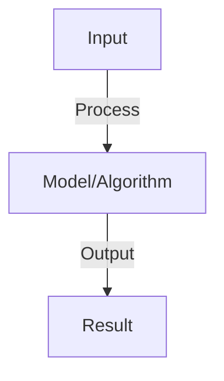
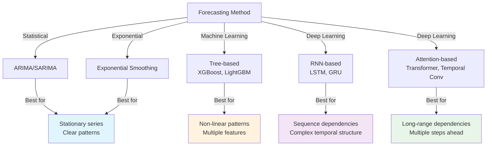
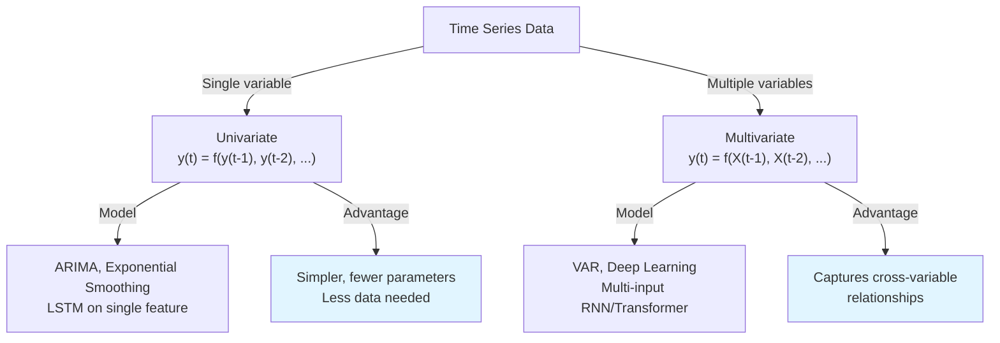
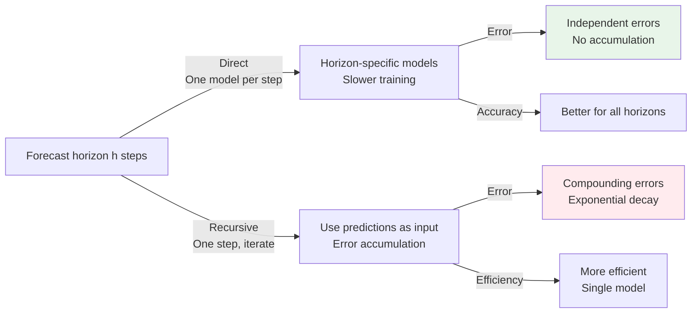

# Time Series Forecasting

## Detailed Explanation

Time series forecasting predicts future values in sequential data where observations are ordered by time and typically have dependencies on past observations. Applications range from stock price prediction and weather forecasting to traffic flow and sensor monitoring. The fundamental challenge is that time series often contain trends (systematic increase/decrease), seasonality (recurring patterns), and noise, requiring models that capture temporal dependencies while remaining robust.

Time series differ from typical supervised learning because: (1) temporal order matters—shuffling examples breaks the problem, (2) future depends on past—previous values are crucial predictors, (3) patterns change—distributions may shift over time requiring adaptive models. Modern approaches range from classical methods (ARIMA, exponential smoothing) to deep learning (RNNs, Transformers, Temporal CNNs). The key is matching model complexity to data characteristics: simple models work well when patterns are stable and regular, while deep models excel with complex nonlinear dependencies.

Time series forecasting is increasingly important as organizations make real-time decisions on streaming data. Understanding it requires appreciating temporal structure, stationarity, autocorrelation, and the dangers of look-ahead bias (using future information to predict the past). It bridges classical statistical methods and modern deep learning.

## Core Intuition

Time series is like predicting tomorrow's weather based on recent weather patterns. You notice that temperature changes gradually (momentum), that seasons repeat (seasonality), and that long-term trends exist (climate). A good forecaster uses all three: 'temperature was 70°F, yesterday it was 69°F (trending up), and it's March (spring warming), so tomorrow will likely be 71°F'. Time series models capture these patterns from past data.

## How It Works

1. Autoregressive (AR): predict from past values y_t = β₀ + Σ βᵢ*y_{t-i} + ε
2. ARIMA: AR + moving average + differencing for non-stationary series
3. Exponential smoothing: weighted average of past (recent values weighted more)
4. RNNs/LSTMs: learn non-linear temporal patterns from sequence
5. Transformers: self-attention over time steps (captures long-range dependencies)
6. Multivariate: multiple input series predict output (e.g., weather → demand)
7. Evaluation: MSE on held-out future, track over time (performance may degrade)

## Architecture / Trade-offs

### Time Series Forecasting Approaches

### Model Complexity vs Data Requirements

| Model | Parameters | Data Needed | Interpretability | Training Speed |
|-------|-----------|------------|-----------------|-----------------|
| **Exponential Smoothing** | Few (2-3) | 10-20 observations | Very high | Very fast |
| **ARIMA** | Few (3-5) | 50-100+ observations | High | Fast |
| **Linear/Ridge Regression** | Medium | 100+ observations | High | Very fast |
| **Tree ensemble** | High (100-1000) | 500+ observations | Medium | Medium |
| **LSTM** | Very high (10K+) | 1000+ observations | Low | Slow |
| **Transformer** | Extreme (100K+) | 10K+ observations | Very low | Very slow |

### Univariate vs Multivariate

### Forecasting Horizons

| Horizon | Difficulty | Accuracy Decay | Method |
|---------|-----------|-----------------|---------|
| **1-step (nowcasting)** | Easy | Minimal | Any method works |
| **Short-term (1-7 steps)** | Medium | Gradual | Statistical or basic ML |
| **Medium-term (1-4 weeks)** | Hard | Significant | ML or deep learning |
| **Long-term (1-12 months)** | Very hard | Severe | External factors essential |
| **Multi-step ahead** | Hardest | Compounding error | Teacher forcing or ensemble |

### Error Accumulation: Direct vs Recursive

### Handling Non-stationarity

| Technique | Use When | Trade-off |
|-----------|----------|-----------|
| **Differencing** | Trend present | May lose information |
| **Detrending** | Linear trend | Assumes trend is linear |
| **Seasonal decomposition** | Seasonality evident | Assumes fixed seasonality |
| **Adaptive models** | Patterns change over time | More complex |
| **Online learning** | Streaming data | Need continuous updates |
| **Time window** | Recent data matters most | Loses historical patterns |
## Interview Q&A

**Q: When should you use ARIMA vs neural networks?**
A: ARIMA: stationary data, small datasets, interpretability important. Neural: non-linear patterns, large datasets, complex relationships. Hybrid: ARIMA for baseline, NN if ARIMA not good enough.

**Q: What is stationarity and why does it matter?**
A: Stationarity: statistical properties (mean, variance) constant over time. ARIMA assumes stationarity (if not, differencing). Non-stationary: trends, seasonality. Check: plots, statistical tests (ADF). Transform (log, diff) to achieve stationarity.

**Q: How do you handle seasonality in forecasting?**
A: Seasonality: repeating patterns (e.g., weekly, yearly). Model: (1) seasonal ARIMA (SARIMA), (2) include seasonal variables, (3) RNNs learn automatically. Challenge: long-range dependencies (annual seasonality = 365 steps).

**Q: What's the difference between one-step-ahead and multi-step forecasting?**
A: One-step: predict t+1 given up to t (easier). Multi-step: predict t+1, t+2, ..., t+h (harder, error accumulates). Approaches: recursive (use predictions), direct (separate models per step), sequence-to-sequence (encoder-decoder).

**Q: How do you evaluate forecasting models?**
A: Metrics: MAE (mean absolute error), RMSE (penalizes large errors), MAPE (relative error). Baseline: use last value or seasonal average. Compare: your model vs. baseline. Cross-validation: time-series CV (train on past, test on future).

## Best Practices

- Apply best practices specific to this concept
- Consider edge cases and failure modes
- Test on representative data
- Evaluate comprehensively

## Common Pitfalls

- Avoid over-simplification
- Watch for incorrect assumptions
- Test edge cases thoroughly
- Monitor for degradation

## Code Examples

See the associated notebook for implementation and real-world examples.

## Related Concepts

- Understand prerequisites first
- Connect related topics
- Build integrated knowledge
