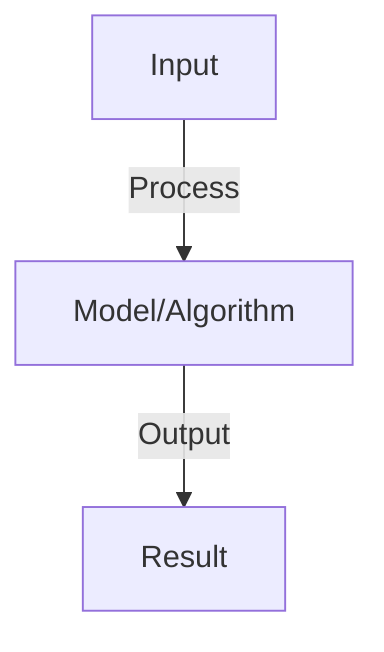

# Anomaly Detection

## Detailed Explanation

Identify unusual or outlier data points that deviate from normal patterns

## Core Intuition

Identify unusual or outlier data points that deviate from normal patterns Understanding this concept enables better system design and problem-solving.

## How It Works

1. Supervised: anomalies labeled, treat as classification (imbalanced)
2. Unsupervised: no labels, assume anomalies rare and different from normal
3. Statistical: model distribution, flag low-probability points
4. Distance-based: compute distance to nearest neighbors, outliers far from others
5. Density-based: DBSCAN, LOF (local outlier factor), low-density = anomaly
6. Autoencoders: reconstruct normal data well, reconstruct anomalies poorly
7. One-class SVM: learn boundary around normal data, points outside = anomalies

## Architecture / Trade-offs

Key trade-offs and design considerations for this concept.

## Interview Q&A

**Q: Why is anomaly detection hard?**
A: Challenges: (1) anomalies rare (imbalanced data), (2) definition unclear (what's anomalous?), (3) new types emerge (can't train for all), (4) cost asymmetric (missing anomaly vs. false alarm have different costs).

**Q: How do you choose threshold for anomaly score?**
A: Tunable: compute score for each sample, threshold to classify. High threshold: few anomalies flagged (high precision, low recall). Low threshold: many anomalies flagged (low precision, high recall). Set based on business cost.

**Q: What's the difference between outliers and anomalies?**
A: Outliers: statistically extreme but not anomalous (tall person in normal sample). Anomalies: contextually abnormal (car breakdown in traffic). Anomaly detection looks for contextual anomalies (harder, requires domain knowledge).

**Q: Can you use deep learning for anomaly detection?**
A: Yes: autoencoders learn normal patterns, reconstruct anomalies poorly. Use reconstruction error as anomaly score. Or: one-class neural networks. Challenge: needs lots of normal data, can overfit to noise.

**Q: How do you validate anomaly detection?**
A: Labeled data (test set): precision, recall, F1. No labels: inspect flagged samples (does system find meaningful anomalies?). Baseline: statistical method or random. Monitoring: track false positive rate in production (adjust threshold if needed).

## Best Practices

- Apply best practices specific to this concept
- Consider edge cases and failure modes
- Test on representative data
- Evaluate comprehensively

## Common Pitfalls

- Avoid over-simplification
- Watch for incorrect assumptions
- Test edge cases thoroughly
- Monitor for degradation

## Code Examples

See the associated notebook for implementation and real-world examples.

## Related Concepts

- Understand prerequisites first
- Connect related topics
- Build integrated knowledge
