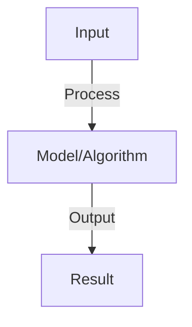
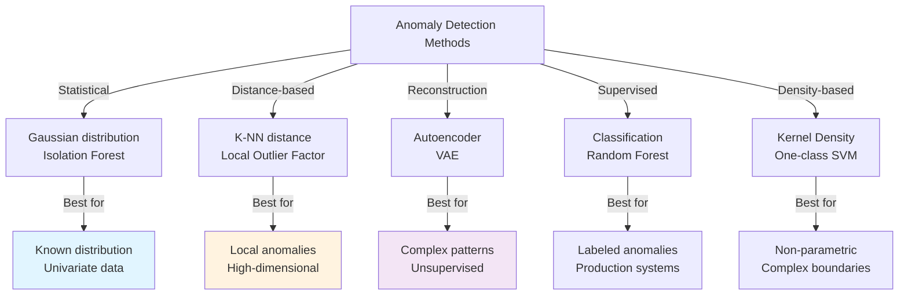
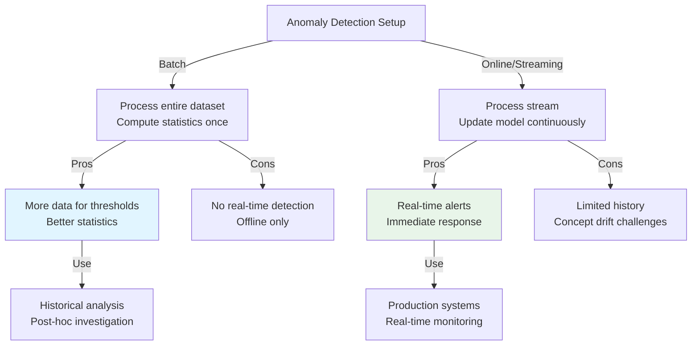
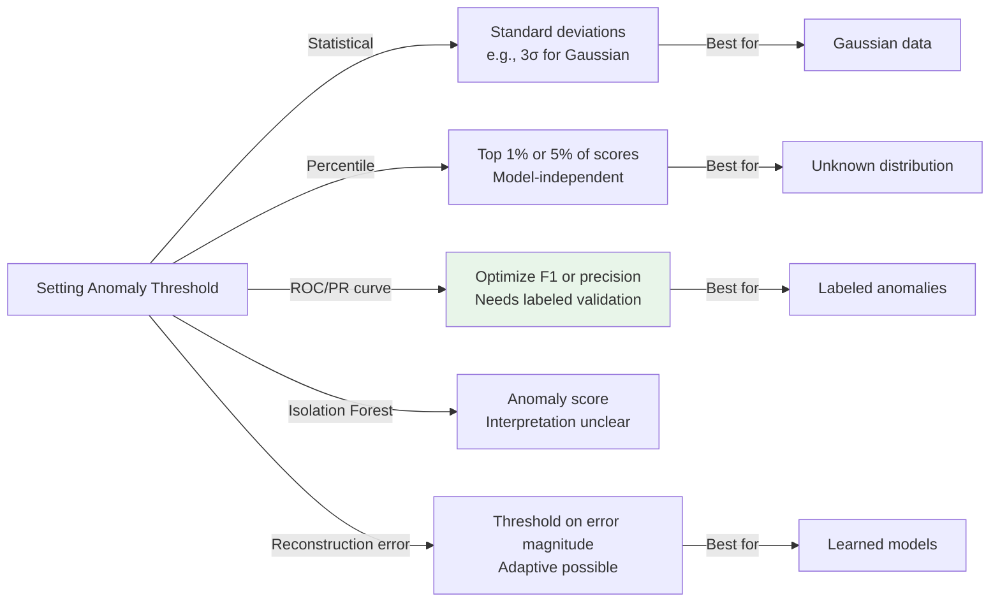

# Anomaly Detection

## Detailed Explanation

Anomaly detection identifies outliers or unusual observations in data that deviate from normal patterns. Applications include fraud detection (unusual transactions), medical diagnosis (abnormal test results), manufacturing quality control (defective products), and cybersecurity (intrusion detection). The core challenge is defining 'normal'—normal varies by context, can change over time, and unusual observations are often rarer than normal ones, making training data imbalanced.

Approaches vary by problem: (1) Statistical methods assume normal data follows known distributions and flag significant deviations, (2) Reconstruction-based methods (autoencoders, isolation forests) assume normal data compresses well while anomalies don't, (3) Density-based methods find regions of low density in the data space, (4) Supervised approaches if labeled anomalies are available. Each has trade-offs: statistical methods require distribution assumptions, reconstruction methods need adequate normal data, density methods struggle in high dimensions.

Anomaly detection is crucial for high-stakes domains where bad events (fraud, system failures) are rare but expensive. Understanding it requires statistical thinking, domain knowledge (what's actually anomalous in this context), and appreciation for imbalanced learning. It's fundamentally different from classification since the 'anomaly' class may be poorly represented or change over time.

## Core Intuition

Most credit card transactions are normal—you buy coffee, gas, groceries. Anomaly detection is like a bank's fraud detector: when a transaction doesn't fit your normal pattern (buying an airline ticket at 3 AM from another country), it flags it as suspicious. The detector learns your normal patterns and sounds alarms when something's different.

## How It Works

1. Supervised: anomalies labeled, treat as classification (imbalanced)
2. Unsupervised: no labels, assume anomalies rare and different from normal
3. Statistical: model distribution, flag low-probability points
4. Distance-based: compute distance to nearest neighbors, outliers far from others
5. Density-based: DBSCAN, LOF (local outlier factor), low-density = anomaly
6. Autoencoders: reconstruct normal data well, reconstruct anomalies poorly
7. One-class SVM: learn boundary around normal data, points outside = anomalies

## Architecture / Trade-offs

### Anomaly Detection Approaches

### Supervised vs Unsupervised

| Aspect | Unsupervised | Supervised |
|--------|-------------|-----------|
| **Labels needed** | None | Full anomaly labels |
| **Class imbalance** | N/A (no labels) | Extreme (1-10% anomalies) |
| **False positive cost** | May be high | Controllable |
| **False negative cost** | May miss anomalies | Controllable |
| **Adaptability** | Good (learns normal) | Fixed to training anomalies |
| **Deployment** | Immediate | Need labeled data |
| **Interpretability** | May be unclear | Can explain why anomalous |

### Batch vs Online Detection

### Point vs Contextual Anomalies

| Type | Definition | Detection | Challenge |
|------|-----------|-----------|-----------|
| **Point anomaly** | Single value far from distribution | Easy (statistical) | Simple cases only |
| **Contextual anomaly** | Value unusual in context | Hard (requires context) | Context-dependent threshold |
| **Collective anomaly** | Group of values unusual together | Very hard (collective) | Need multi-variate model |

### Threshold Selection Methods

### Imbalanced Learning Solutions

| Solution | How It Works | Pros | Cons |
|----------|------------|------|------|
| **Threshold moving** | Change decision boundary | Simple | May not transfer |
| **Class weighting** | Higher weight for anomalies | Natural | Requires tuning |
| **Oversampling anomalies** | Duplicate anomaly samples | Increases data | Can overfit |
| **Undersampling normals** | Reduce normal samples | Faster training | Loss of information |
| **Ensemble methods** | Combine multiple models | Robust | More complex |
| **One-class learning** | Learn normal only | Natural fit | Harder to train |
## Interview Q&A

**Q: Why is anomaly detection hard?**
A: Challenges: (1) anomalies rare (imbalanced data), (2) definition unclear (what's anomalous?), (3) new types emerge (can't train for all), (4) cost asymmetric (missing anomaly vs. false alarm have different costs).

**Q: How do you choose threshold for anomaly score?**
A: Tunable: compute score for each sample, threshold to classify. High threshold: few anomalies flagged (high precision, low recall). Low threshold: many anomalies flagged (low precision, high recall). Set based on business cost.

**Q: What's the difference between outliers and anomalies?**
A: Outliers: statistically extreme but not anomalous (tall person in normal sample). Anomalies: contextually abnormal (car breakdown in traffic). Anomaly detection looks for contextual anomalies (harder, requires domain knowledge).

**Q: Can you use deep learning for anomaly detection?**
A: Yes: autoencoders learn normal patterns, reconstruct anomalies poorly. Use reconstruction error as anomaly score. Or: one-class neural networks. Challenge: needs lots of normal data, can overfit to noise.

**Q: How do you validate anomaly detection?**
A: Labeled data (test set): precision, recall, F1. No labels: inspect flagged samples (does system find meaningful anomalies?). Baseline: statistical method or random. Monitoring: track false positive rate in production (adjust threshold if needed).

## Best Practices

- Apply best practices specific to this concept
- Consider edge cases and failure modes
- Test on representative data
- Evaluate comprehensively

## Common Pitfalls

- Avoid over-simplification
- Watch for incorrect assumptions
- Test edge cases thoroughly
- Monitor for degradation

## Code Examples

See the associated notebook for implementation and real-world examples.

## Related Concepts

- Understand prerequisites first
- Connect related topics
- Build integrated knowledge
