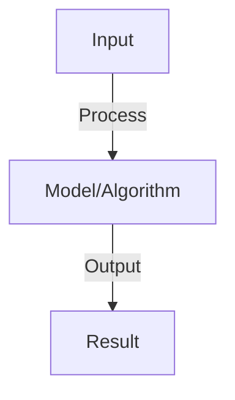
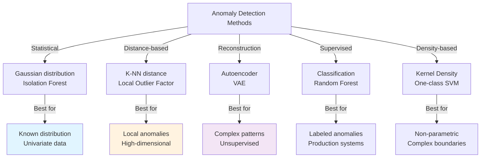
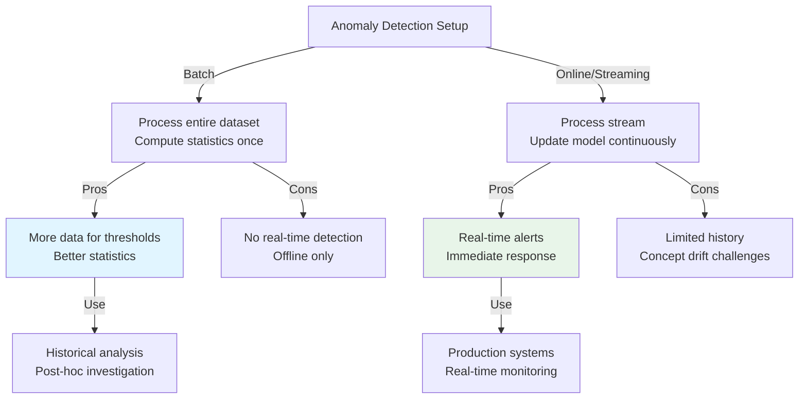
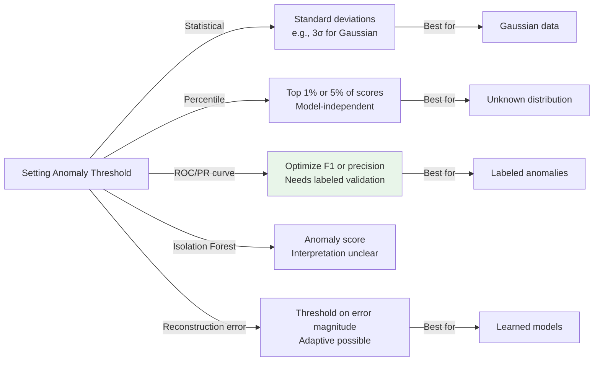

# Anomaly Detection

## Detailed Explanation

Anomaly Detection identifies unusual data points (outliers, anomalies) that deviate from normal patterns, crucial for fraud detection, equipment failure prediction, security. Normal data has patterns; anomalies violate those patterns. Approaches differ: supervised (label anomalies during training), unsupervised (find outliers without labels), or semi-supervised (labels only for normal, model flags deviations). Most real-world problems are unsupervised: anomalies are rare and unknown, so labeling is expensive and incomplete.

Unsupervised methods assume anomalies are rare and different from normal data. Isolation Forest isolates anomalies (separate from normal data) recursively; Local Outlier Factor detects points with low density relative to neighbors; One-Class SVM finds hyperplane separating normal from everything else. Deep learning approaches use autoencoders (anomalies have high reconstruction error) or Variational Autoencoders (anomalies have high log-likelihood under reconstruction). Time-series anomalies use forecasting: actual vs predicted values reveal anomalies. Streaming anomaly detection must detect changes in real-time with limited memory.

Anomaly detection is conceptually simple but practically complex: defining 'normal' is hard (operational drift, concept change), evaluation is tricky (ground truth is rare), false positive/negative costs matter. Combining methods (ensemble) often improves performance. Domain knowledge is crucial: knowing what anomalies matter in your context guides feature engineering and threshold selection. Understanding that anomalies span many forms (pointwise, contextual, collective) helps choose methods. Modern approaches incorporate deep learning for automatic feature learning but statistical methods remain valuable for interpretability and small-data regimes.

## Core Intuition

Anomaly detection is like a security guard: learns what normal behavior looks like (people walking normally, cars driving normally), then flags unusual behavior (person running, car going backward). The challenge is defining 'normal' broadly enough (different people walk differently) but tightly enough (actually catch anomalies).

## How It Works

1. Supervised: anomalies labeled, treat as classification (imbalanced)
2. Unsupervised: no labels, assume anomalies rare and different from normal
3. Statistical: model distribution, flag low-probability points
4. Distance-based: compute distance to nearest neighbors, outliers far from others
5. Density-based: DBSCAN, LOF (local outlier factor), low-density = anomaly
6. Autoencoders: reconstruct normal data well, reconstruct anomalies poorly
7. One-class SVM: learn boundary around normal data, points outside = anomalies

## Architecture / Trade-offs

### Anomaly Detection Approaches

### Supervised vs Unsupervised

| Aspect | Unsupervised | Supervised |
|--------|-------------|-----------|
| **Labels needed** | None | Full anomaly labels |
| **Class imbalance** | N/A (no labels) | Extreme (1-10% anomalies) |
| **False positive cost** | May be high | Controllable |
| **False negative cost** | May miss anomalies | Controllable |
| **Adaptability** | Good (learns normal) | Fixed to training anomalies |
| **Deployment** | Immediate | Need labeled data |
| **Interpretability** | May be unclear | Can explain why anomalous |

### Batch vs Online Detection

### Point vs Contextual Anomalies

| Type | Definition | Detection | Challenge |
|------|-----------|-----------|-----------|
| **Point anomaly** | Single value far from distribution | Easy (statistical) | Simple cases only |
| **Contextual anomaly** | Value unusual in context | Hard (requires context) | Context-dependent threshold |
| **Collective anomaly** | Group of values unusual together | Very hard (collective) | Need multi-variate model |

### Threshold Selection Methods

### Imbalanced Learning Solutions

| Solution | How It Works | Pros | Cons |
|----------|------------|------|------|
| **Threshold moving** | Change decision boundary | Simple | May not transfer |
| **Class weighting** | Higher weight for anomalies | Natural | Requires tuning |
| **Oversampling anomalies** | Duplicate anomaly samples | Increases data | Can overfit |
| **Undersampling normals** | Reduce normal samples | Faster training | Loss of information |
| **Ensemble methods** | Combine multiple models | Robust | More complex |
| **One-class learning** | Learn normal only | Natural fit | Harder to train |
## Interview Q&A

**Q: Why is anomaly detection hard?**
A: Challenges: (1) anomalies rare (imbalanced data), (2) definition unclear (what's anomalous?), (3) new types emerge (can't train for all), (4) cost asymmetric (missing anomaly vs. false alarm have different costs).

**Q: How do you choose threshold for anomaly score?**
A: Tunable: compute score for each sample, threshold to classify. High threshold: few anomalies flagged (high precision, low recall). Low threshold: many anomalies flagged (low precision, high recall). Set based on business cost.

**Q: What's the difference between outliers and anomalies?**
A: Outliers: statistically extreme but not anomalous (tall person in normal sample). Anomalies: contextually abnormal (car breakdown in traffic). Anomaly detection looks for contextual anomalies (harder, requires domain knowledge).

**Q: Can you use deep learning for anomaly detection?**
A: Yes: autoencoders learn normal patterns, reconstruct anomalies poorly. Use reconstruction error as anomaly score. Or: one-class neural networks. Challenge: needs lots of normal data, can overfit to noise.

**Q: How do you validate anomaly detection?**
A: Labeled data (test set): precision, recall, F1. No labels: inspect flagged samples (does system find meaningful anomalies?). Baseline: statistical method or random. Monitoring: track false positive rate in production (adjust threshold if needed).

## Best Practices

- Apply best practices specific to this concept
- Consider edge cases and failure modes
- Test on representative data
- Evaluate comprehensively

## Common Pitfalls

- Avoid over-simplification
- Watch for incorrect assumptions
- Test edge cases thoroughly
- Monitor for degradation

## Code Examples

See the associated notebook for implementation and real-world examples.

## Related Concepts

- Understand prerequisites first
- Connect related topics
- Build integrated knowledge
