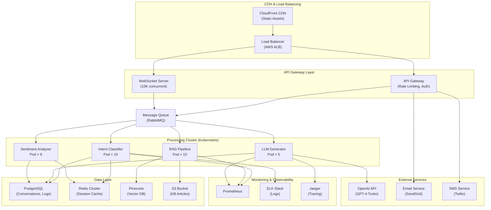

## System Architecture (Infrastructure & Deployment)

**Infrastructure Components:**
- **Compute**: Kubernetes cluster (auto-scaling 5-50 pods based on load)
- **Storage**: PostgreSQL (conversations), Redis (cache), Pinecone (vectors), S3 (KB)
- **External APIs**: OpenAI (LLM), SendGrid (email), Twilio (SMS)
- **Monitoring**: Prometheus (metrics), ELK (logs), Jaeger (distributed tracing)
- **CDN**: CloudFront for static asset caching
- **Load Balancing**: AWS ALB with health checks and auto-scaling policies