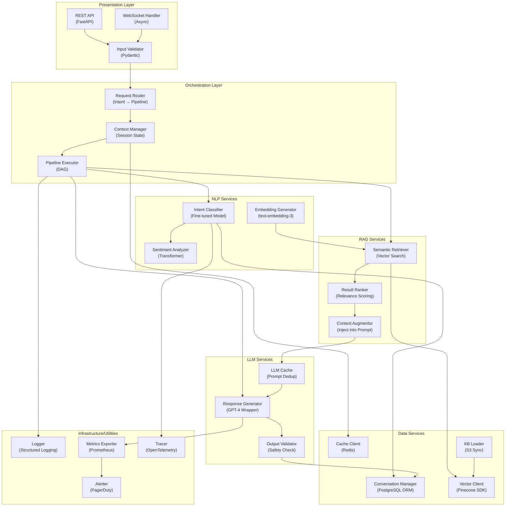

## Application Architecture (Components & Layers)

**Layer Breakdown:**
- **Presentation**: REST API + WebSocket with async I/O
- **Orchestration**: Request routing, pipeline execution, context management
- **NLP Services**: Intent classification, embeddings, sentiment analysis
- **RAG Services**: Vector retrieval, ranking, context augmentation
- **LLM Services**: Caching, generation, safety validation
- **Data Services**: Database access, vector store, cache, KB management
- **Infrastructure**: Logging, metrics, tracing, alerting