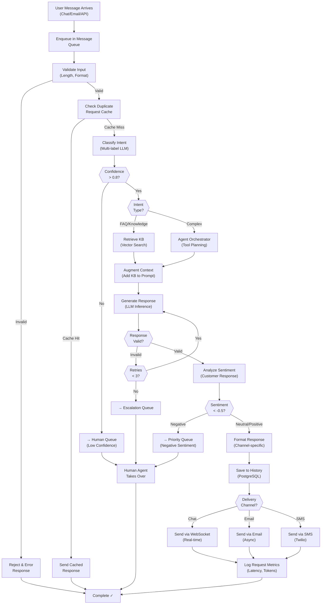

## Process Flow (Request to Response)

**Key Decision Points:**
1. **Confidence Check**: If intent confidence < 80%, escalate to human
2. **Intent Type**: FAQ/knowledge → RAG path, complex → agent path
3. **Output Validation**: If response invalid after retries, escalate
4. **Sentiment Analysis**: If negative sentiment, prioritize human pickup
5. **Channel Routing**: Deliver via original channel (Chat/Email/SMS)

**Error Paths:**
- Invalid input → reject with error
- Low confidence classification → escalate
- Generation failure → retry (max 3), then escalate
- Negative sentiment → prioritize escalation queue

**Optimization Points:**
- Request deduplication (cache hits avoid full pipeline)
- Batch processing during peak hours
- Async email/SMS (don't block response)
- Context caching (avoid re-retrieving same KB articles)