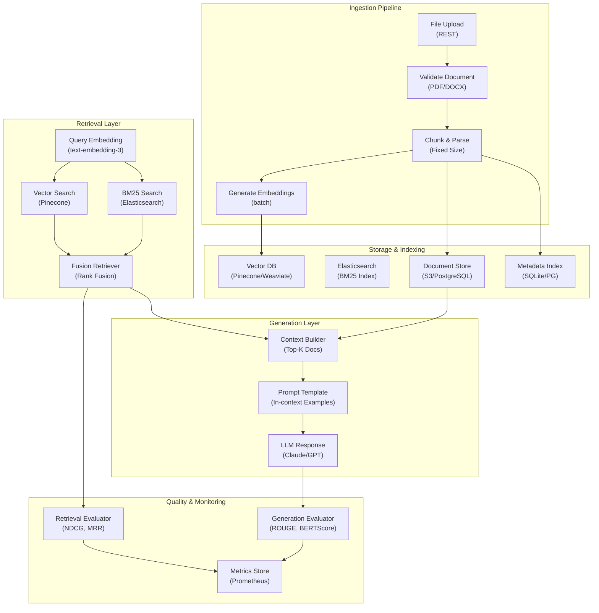

## System Architecture (RAG Document QA)

```mermaid
graph TB
    subgraph Ingestion["Ingestion Pipeline"]
        UPLOAD["File Upload<br/>(REST)"]
        VALIDATE_DOC["Validate Document<br/>(PDF/DOCX)"]
        CHUNK["Chunk & Parse<br/>(Fixed Size)"]
        EMBED["Generate Embeddings<br/>(batch)"]
    end

    subgraph Retrieval["Retrieval Layer"]
        QUERY_EMBED["Query Embedding<br/>(text-embedding-3)"]
        VECTOR_SEARCH["Vector Search<br/>(Pinecone)"]
        BM25["BM25 Search<br/>(Elasticsearch)"]
        FUSION["Fusion Retriever<br/>(Rank Fusion)"]
    end

    subgraph Generation["Generation Layer"]
        CONTEXT_BUILDER["Context Builder<br/>(Top-K Docs)"]
        PROMPT_BUILDER["Prompt Template<br/>(In-context Examples)"]
        LLM_GEN["LLM Response<br/>(Claude/GPT)"]
    end

    subgraph Storage["Storage & Indexing"]
        VECTOR_DB["Vector DB<br/>(Pinecone/Weaviate)"]
        ELASTIC["Elasticsearch<br/>(BM25 Index)"]
        DOCS_STORE["Document Store<br/>(S3/PostgreSQL)"]
        METADATA["Metadata Index<br/>(SQLite/PG)"]
    end

    subgraph Monitoring["Quality & Monitoring"]
        RETRIEVAL_EVAL["Retrieval Evaluator<br/>(NDCG, MRR)"]
        GENERATION_EVAL["Generation Evaluator<br/>(ROUGE, BERTScore)"]
        METRICS["Metrics Store<br/>(Prometheus)"]
    end

    UPLOAD --> VALIDATE_DOC
    VALIDATE_DOC --> CHUNK
    CHUNK --> EMBED
    EMBED --> VECTOR_DB
    CHUNK --> DOCS_STORE
    CHUNK --> METADATA

    QUERY_EMBED --> VECTOR_SEARCH
    QUERY_EMBED --> BM25
    VECTOR_SEARCH --> FUSION
    BM25 --> FUSION

    FUSION --> CONTEXT_BUILDER
    DOCS_STORE --> CONTEXT_BUILDER
    CONTEXT_BUILDER --> PROMPT_BUILDER
    PROMPT_BUILDER --> LLM_GEN

    LLM_GEN --> GENERATION_EVAL
    FUSION --> RETRIEVAL_EVAL
    RETRIEVAL_EVAL --> METRICS
    GENERATION_EVAL --> METRICS
```