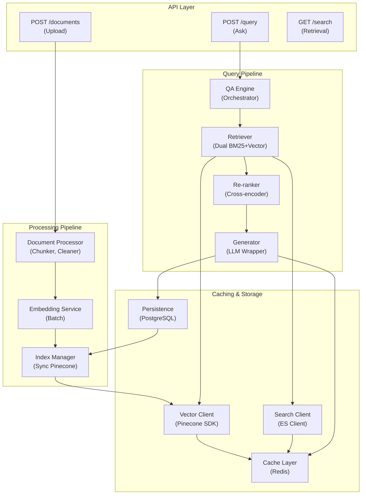

## Application Architecture (RAG System)

```mermaid
graph TB
    subgraph API["API Layer"]
        UPLOAD_EP["POST /documents<br/>(Upload)"]
        QUERY_EP["POST /query<br/>(Ask)"]
        SEARCH_EP["GET /search<br/>(Retrieval)"]
    end

    subgraph Pipeline["Processing Pipeline"]
        DOC_PROCESSOR["Document Processor<br/>(Chunker, Cleaner)"]
        EMBEDDING_SVC["Embedding Service<br/>(Batch)"]
        INDEX_MGR["Index Manager<br/>(Sync Pinecone)"]
    end

    subgraph Query["Query Pipeline"]
        QA_ENGINE["QA Engine<br/>(Orchestrator)"]
        RETRIEVER["Retriever<br/>(Dual BM25+Vector)"]
        RE_RANKER["Re-ranker<br/>(Cross-encoder)"]
        GENERATOR["Generator<br/>(LLM Wrapper)"]
    end

    subgraph Cache["Caching & Storage"]
        CACHE_LAYER["Cache Layer<br/>(Redis)"]
        VECTOR_CLIENT["Vector Client<br/>(Pinecone SDK)"]
        SEARCH_CLIENT["Search Client<br/>(ES Client)"]
        PERSIST["Persistence<br/>(PostgreSQL)"]
    end

    UPLOAD_EP --> DOC_PROCESSOR
    DOC_PROCESSOR --> EMBEDDING_SVC
    EMBEDDING_SVC --> INDEX_MGR

    INDEX_MGR --> VECTOR_CLIENT
    PERSIST --> INDEX_MGR

    QUERY_EP --> QA_ENGINE
    QA_ENGINE --> RETRIEVER
    RETRIEVER --> VECTOR_CLIENT
    RETRIEVER --> SEARCH_CLIENT

    VECTOR_CLIENT --> CACHE_LAYER
    SEARCH_CLIENT --> CACHE_LAYER

    RETRIEVER --> RE_RANKER
    RE_RANKER --> GENERATOR
    GENERATOR --> CACHE_LAYER
    GENERATOR --> PERSIST
```