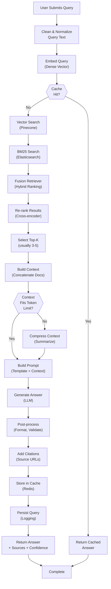

## Process Flow (RAG Query to Answer)

```mermaid
graph TD
    USER_QUERY["User Submits Query"] --> CLEAN["Clean & Normalize<br/>Query Text"]

    CLEAN --> EMBED_QUERY["Embed Query<br/>(Dense Vector)"]
    EMBED_QUERY --> CACHE_CHECK{{"Cache<br/>Hit?"}}

    CACHE_CHECK -->|Yes| SERVE_CACHED["Return Cached<br/>Answer"]
    CACHE_CHECK -->|No| VECTOR_SEARCH["Vector Search<br/>(Pinecone)"]

    VECTOR_SEARCH --> BM25_SEARCH["BM25 Search<br/>(Elasticsearch)"]
    BM25_SEARCH --> FUSION["Fusion Retriever<br/>(Hybrid Ranking)"]

    FUSION --> RERANK["Re-rank Results<br/>(Cross-encoder)"]
    RERANK --> SELECT["Select Top-K<br/>(usually 3-5)"]

    SELECT --> BUILD_CONTEXT["Build Context<br/>(Concatenate Docs)"]
    BUILD_CONTEXT --> CHECK_LENGTH{{"Context<br/>Fits Token<br/>Limit?"}}

    CHECK_LENGTH -->|No| COMPRESS["Compress Context<br/>(Summarize)"]
    CHECK_LENGTH -->|Yes| BUILD_PROMPT["Build Prompt<br/>(Template + Context)"]

    COMPRESS --> BUILD_PROMPT
    BUILD_PROMPT --> GENERATE["Generate Answer<br/>(LLM)"]

    GENERATE --> POST_PROCESS["Post-process<br/>(Format, Validate)"]
    POST_PROCESS --> CITE["Add Citations<br/>(Source URLs)"]

    CITE --> CACHE_STORE["Store in Cache<br/>(Redis)"]
    CACHE_STORE --> PERSIST_STORE["Persist Query<br/>(Logging)"]

    PERSIST_STORE --> RETURN["Return Answer<br/>+ Sources + Confidence"]

    RETURN --> END["Complete"]
    SERVE_CACHED --> END
```