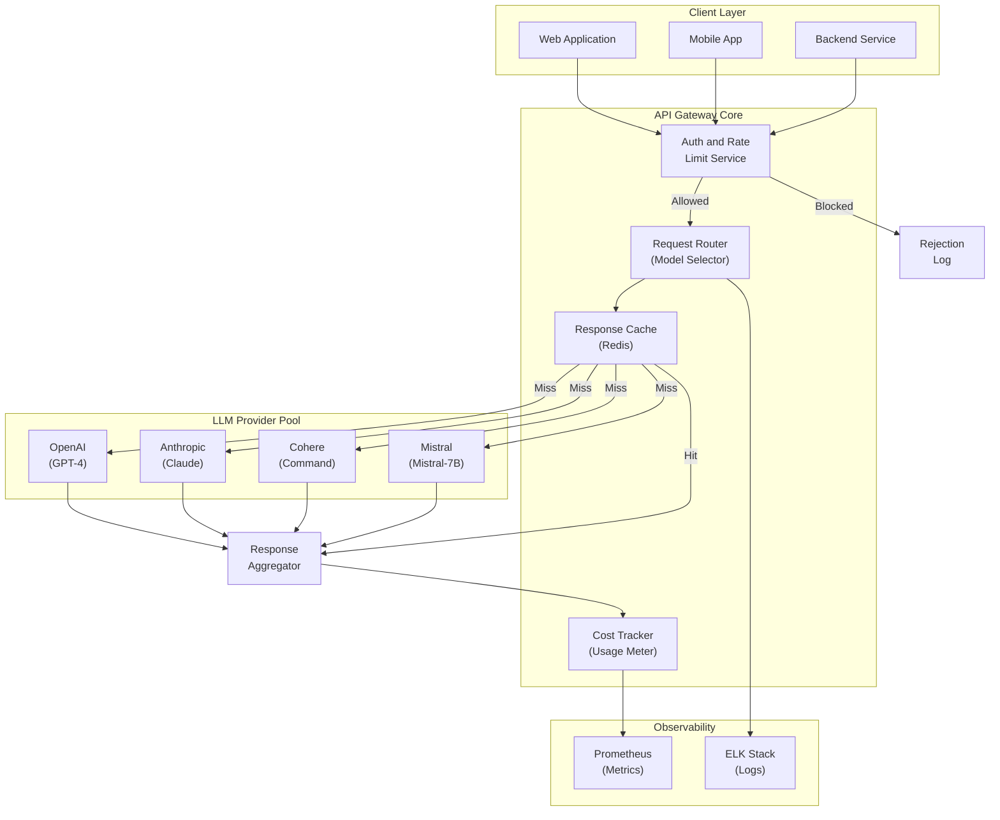

# LLM API Gateway - System Architecture

**Infrastructure Components:**
- **Auth and Rate Limiting**: JWT validation, per-key quota enforcement, IP allowlist
- **Request Router**: Model selection based on cost, latency, capability requirements
- **Provider Pool**: OpenAI, Anthropic, Cohere, Mistral with fallback routing
- **Response Cache**: Redis for deduplicating identical prompts (cache key = hash of prompt)
- **Cost Tracker**: Per-token usage metering, budget alerts, chargeback reporting
- **Observability**: Prometheus metrics, ELK logs for audit and debugging
