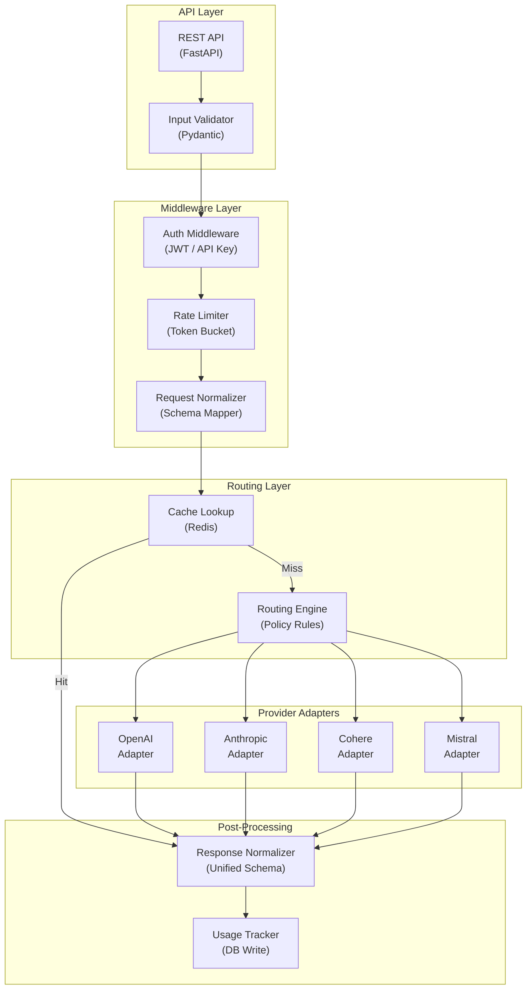

# LLM API Gateway - Application Architecture

**Layer Breakdown:**
- **API Layer**: FastAPI REST endpoints with Pydantic request/response validation
- **Middleware**: JWT/API key auth, token-bucket rate limiting, schema normalization
- **Routing Layer**: Redis cache check first, then rule-based provider selection
- **Provider Adapters**: Thin adapters mapping unified schema to each provider API
- **Post-Processing**: Normalize provider responses to unified schema, write usage metrics
