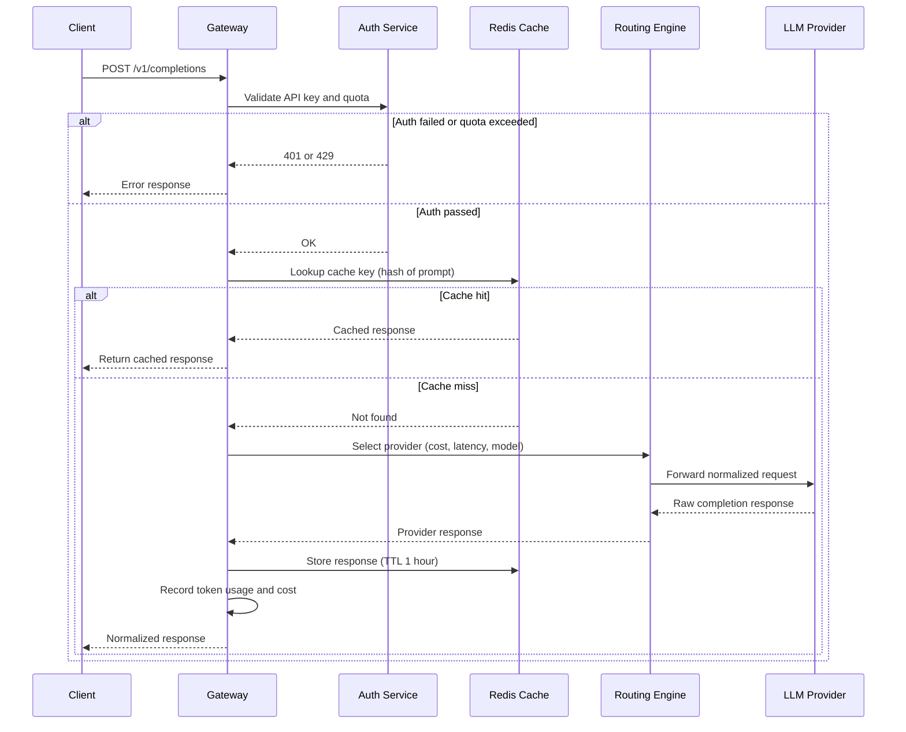

# LLM API Gateway - Process Flow

**Key Decision Points:**
1. **Auth Check**: API key validity and per-key quota enforcement before any processing
2. **Cache Lookup**: Identical prompts return cached responses, avoiding duplicate LLM calls
3. **Provider Selection**: Router picks provider based on model requirements and cost policy
4. **Error Handling**: Auth failures return 401, quota exceeded returns 429, provider errors trigger fallback

**Optimization Points:**
- Cache hit rate target 20-40% for repeated queries (FAQ, similar user requests)
- Provider fallback: if primary provider times out, retry on secondary within 500ms
- Async usage recording so billing writes do not block the response path
