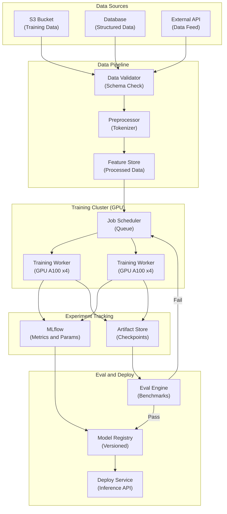

# LLM Finetuning Platform - System Architecture

**Infrastructure Components:**
- **Data Pipeline**: Multi-source ingestion, schema validation, tokenization preprocessing
- **Training Cluster**: GPU workers (A100) with distributed training (DDP/FSDP)
- **Experiment Tracking**: MLflow for params, metrics, artifact versioning
- **Eval Engine**: Automated benchmarks (perplexity, task-specific evals) before registration
- **Model Registry**: Versioned model storage with promotion gates (staging to production)
- **Deploy Service**: Serving infrastructure with auto-scaling inference endpoints
