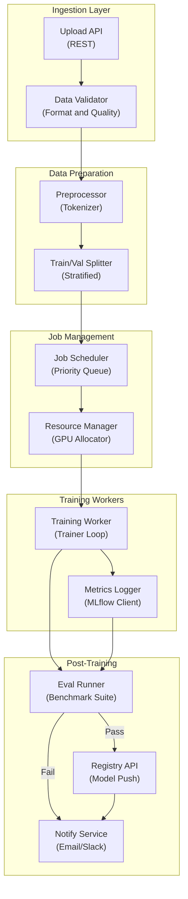

# LLM Finetuning Platform - Application Architecture

**Layer Breakdown:**
- **Ingestion**: REST upload endpoint with format validation (JSONL, CSV) and quality checks
- **Data Preparation**: Tokenization, train/validation split with stratified sampling
- **Job Management**: Priority queue scheduling with GPU resource allocation
- **Training Workers**: Distributed training loop with live metric emission to MLflow
- **Post-Training**: Automated eval against benchmark suite, registry push on pass, notifications
