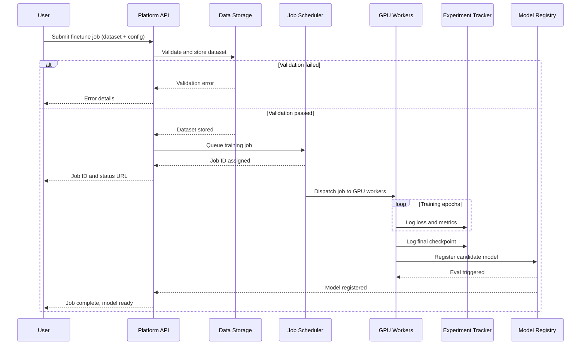

# LLM Finetuning Platform - Process Flow

**Key Decision Points:**
1. **Data Validation**: Schema, format, and quality checks before any GPU resources allocated
2. **Job Queuing**: Priority-based scheduling; high-priority jobs preempt lower-priority ones
3. **Metric Logging**: Real-time training metrics allow early stopping if loss diverges
4. **Eval Gate**: Models must pass benchmark thresholds before registry promotion

**Optimization Points:**
- Mixed precision (BF16) training reduces memory by 2x and speeds training 30-40%
- Gradient checkpointing trades compute for memory on long-context fine-tunes
- Checkpoint every N steps to enable resume from failure without full restart
