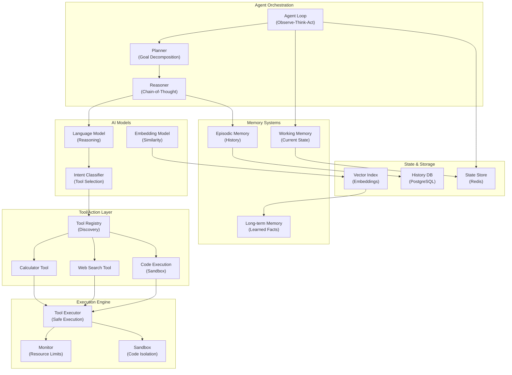

## System Architecture (Agent System)

```mermaid
graph TB
    subgraph Orchestration["Agent Orchestration"]
        AGENT_LOOP["Agent Loop<br/>(Observe-Think-Act)"]
        PLANNER["Planner<br/>(Goal Decomposition)"]
        REASONER["Reasoner<br/>(Chain-of-Thought)"]
    end

    subgraph Tools["Tool/Action Layer"]
        REGISTRY["Tool Registry<br/>(Discovery)"]
        TOOL1["Calculator Tool"]
        TOOL2["Web Search Tool"]
        TOOL3["Code Execution<br/>(Sandbox)"]
    end

    subgraph Memory["Memory Systems"]
        WORKING["Working Memory<br/>(Current State)"]
        LONGTERM["Long-term Memory<br/>(Learned Facts)"]
        EPISODIC["Episodic Memory<br/>(History)"]
    end

    subgraph Models["AI Models"]
        LLM["Language Model<br/>(Reasoning)"]
        EMBEDDING["Embedding Model<br/>(Similarity)"]
        CLASSIFIER["Intent Classifier<br/>(Tool Selection)"]
    end

    subgraph Execution["Execution Engine"]
        EXECUTOR["Tool Executor<br/>(Safe Execution)"]
        MONITOR["Monitor<br/>(Resource Limits)"]
        SANDBOX["Sandbox<br/>(Code Isolation)"]
    end

    subgraph Storage["State & Storage"]
        STATE_STORE["State Store<br/>(Redis)"]
        VECTOR_INDEX["Vector Index<br/>(Embeddings)"]
        HISTORY["History DB<br/>(PostgreSQL)"]
    end

    AGENT_LOOP --> PLANNER
    PLANNER --> REASONER
    REASONER --> LLM

    LLM --> CLASSIFIER
    CLASSIFIER --> REGISTRY
    REGISTRY --> TOOL1
    REGISTRY --> TOOL2
    REGISTRY --> TOOL3

    TOOL1 --> EXECUTOR
    TOOL2 --> EXECUTOR
    TOOL3 --> EXECUTOR

    EXECUTOR --> MONITOR
    EXECUTOR --> SANDBOX

    AGENT_LOOP --> WORKING
    REASONER --> EPISODIC
    EMBEDDING --> VECTOR_INDEX
    AGENT_LOOP --> STATE_STORE

    WORKING --> STATE_STORE
    EPISODIC --> HISTORY
    VECTOR_INDEX --> LONGTERM
```