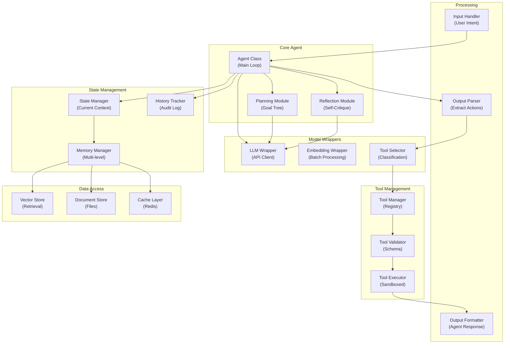

## Application Architecture (Agent)

```mermaid
graph TB
    subgraph Core["Core Agent"]
        AGENT["Agent Class<br/>(Main Loop)"]
        PLANNING["Planning Module<br/>(Goal Tree)"]
        REFLECTION["Reflection Module<br/>(Self-Critique)"]
    end

    subgraph Processing["Processing"]
        INPUT_HANDLER["Input Handler<br/>(User Intent)"]
        OUTPUT_FORMATTER["Output Formatter<br/>(Agent Response)"]
        PARSER["Output Parser<br/>(Extract Actions)"]
    end

    subgraph Models["Model Wrappers"]
        LLM_WRAPPER["LLM Wrapper<br/>(API Client)"]
        EMBEDDING_WRAPPER["Embedding Wrapper<br/>(Batch Processing)"]
        TOOL_SELECTOR["Tool Selector<br/>(Classification)"]
    end

    subgraph Tools["Tool Management"]
        TOOL_MANAGER["Tool Manager<br/>(Registry)"]
        TOOL_VALIDATOR["Tool Validator<br/>(Schema)"]
        TOOL_EXECUTOR["Tool Executor<br/>(Sandboxed)"]
    end

    subgraph State["State Management"]
        STATE_MGR["State Manager<br/>(Current Context)"]
        MEMORY_MGR["Memory Manager<br/>(Multi-level)"]
        HISTORY_TRACKER["History Tracker<br/>(Audit Log)"]
    end

    subgraph Storage["Data Access"]
        VECTOR_STORE["Vector Store<br/>(Retrieval)"]
        DOCUMENT_STORE["Document Store<br/>(Files)"]
        CACHE["Cache Layer<br/>(Redis)"]
    end

    AGENT --> PLANNING
    AGENT --> REFLECTION
    INPUT_HANDLER --> AGENT
    AGENT --> PARSER
    PARSER --> TOOL_SELECTOR

    TOOL_SELECTOR --> TOOL_MANAGER
    TOOL_MANAGER --> TOOL_VALIDATOR
    TOOL_VALIDATOR --> TOOL_EXECUTOR

    AGENT --> LLM_WRAPPER
    PLANNING --> LLM_WRAPPER
    REFLECTION --> LLM_WRAPPER

    TOOL_EXECUTOR --> OUTPUT_FORMATTER
    AGENT --> STATE_MGR
    STATE_MGR --> MEMORY_MGR

    MEMORY_MGR --> VECTOR_STORE
    MEMORY_MGR --> DOCUMENT_STORE
    MEMORY_MGR --> CACHE
    AGENT --> HISTORY_TRACKER
```