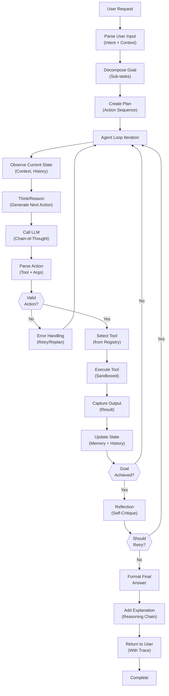

## Process Flow (Agent Execution)

**Agent Execution Characteristics:**
- **Observe**: Get current context (user request, history, state)
- **Think**: Generate reasoning and next action using LLM
- **Act**: Execute selected tool with validated arguments
- **Reflect**: Self-critique and decide if refinement needed
- **Loop**: Continue until goal achieved or max iterations reached