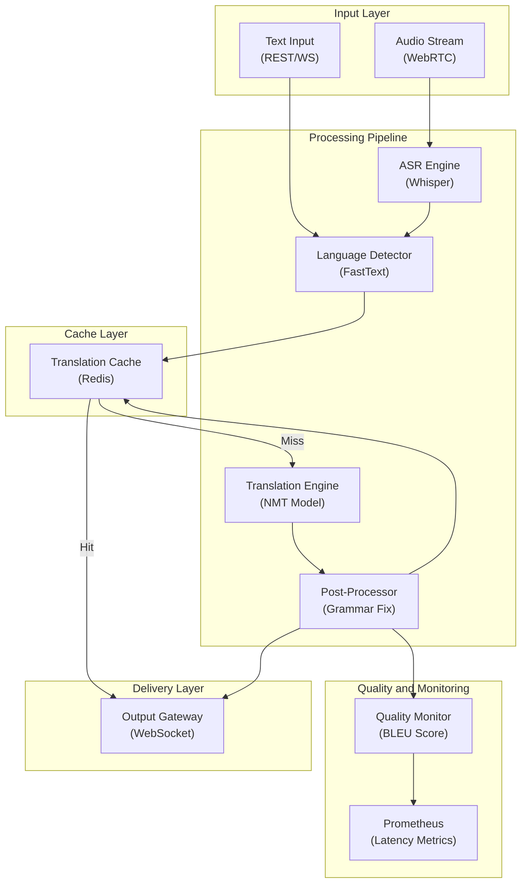

# Realtime Translation Service - System Architecture

**Infrastructure Components:**
- **ASR Engine**: Whisper model for audio-to-text transcription (real-time streaming chunks)
- **Language Detector**: FastText language ID model, sub-5ms latency
- **Translation Engine**: Neural Machine Translation (Helsinki-NLP or NLLB-200) covering 100+ languages
- **Post-Processor**: Grammar correction and fluency improvement on translated text
- **Cache Layer**: Redis for repeated phrase translations (high hit rate on common utterances)
- **Quality Monitor**: BLEU/COMET score tracking for translation quality regression alerts
