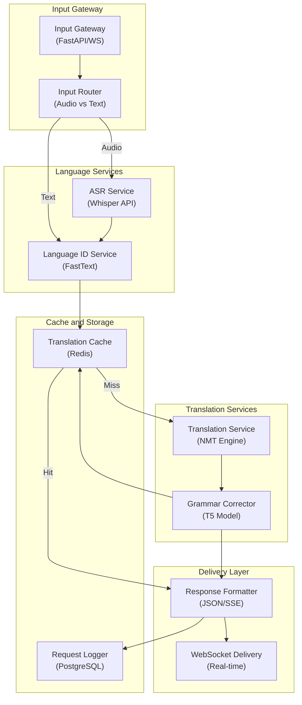

# Realtime Translation Service - Application Architecture

**Layer Breakdown:**
- **Input Gateway**: WebSocket and REST endpoints, routes audio vs text to correct pipeline
- **Language Services**: FastText language detection and Whisper ASR for audio transcription
- **Translation Services**: NMT model for core translation, T5-based grammar correction pass
- **Cache and Storage**: Redis for translation cache, PostgreSQL for audit logging
- **Delivery Layer**: Server-Sent Events or WebSocket streaming for low-latency delivery
