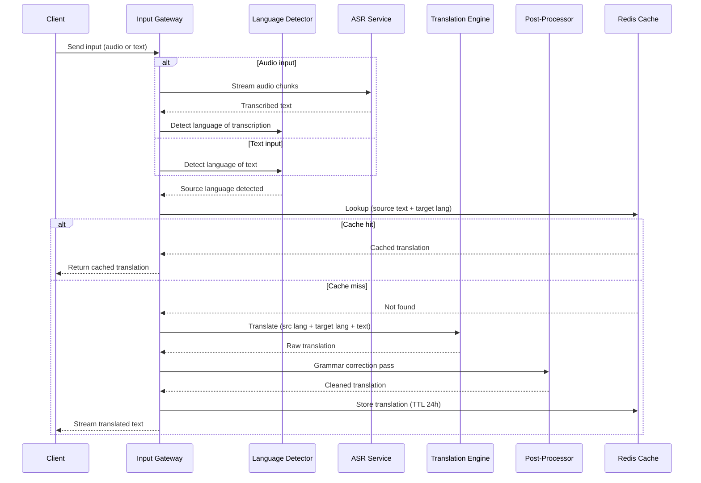

# Realtime Translation Service - Process Flow

**Key Decision Points:**
1. **Input Type Routing**: Audio goes through ASR first, text goes directly to language detection
2. **Language Detection**: Determines source language before cache lookup or translation
3. **Cache Check**: Common phrases and sentences served from Redis without NMT model call
4. **Post-Processing**: Grammar correction improves fluency of raw NMT output

**Optimization Points:**
- Chunk audio at 500ms intervals for streaming translation with low perceived latency
- Cache TTL 24 hours for common business phrases; shorter TTL for dynamic content
- Batch short segments together to improve NMT throughput at cost of minor latency
