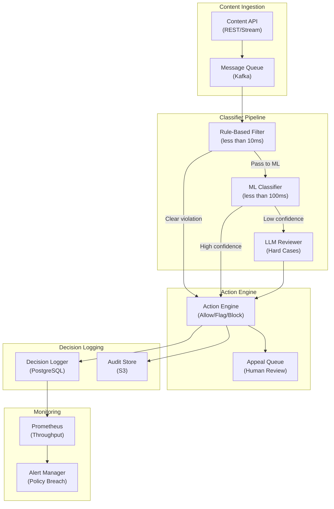

# LLM Content Moderation - System Architecture

**Infrastructure Components:**
- **Rule-Based Filter**: Regex and keyword blocklist, sub-10ms, catches obvious violations
- **ML Classifier**: Fine-tuned transformer (toxicity, hate speech, NSFW), sub-100ms
- **LLM Reviewer**: Full LLM review for ambiguous or borderline content, 1-5 seconds
- **Action Engine**: Enforces policy decisions (allow, soft filter, block, shadowban)
- **Appeal Queue**: Human review interface for contested moderation decisions
- **Audit Store**: Immutable S3 log of all moderation decisions for compliance
