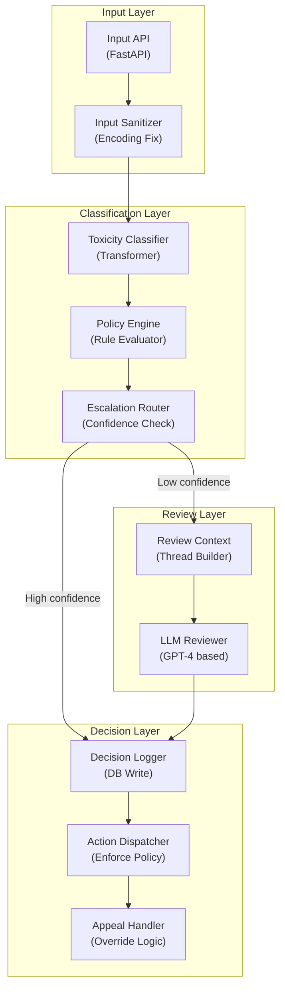

# LLM Content Moderation - Application Architecture

**Layer Breakdown:**
- **Input Layer**: FastAPI endpoint with sanitization (encoding normalization, length limits)
- **Classification Layer**: Transformer-based toxicity scoring, policy rule application, confidence routing
- **Review Layer**: LLM reviewer with full thread context for nuanced moderation decisions
- **Decision Layer**: Persistent logging of all decisions, policy enforcement, appeal handling
