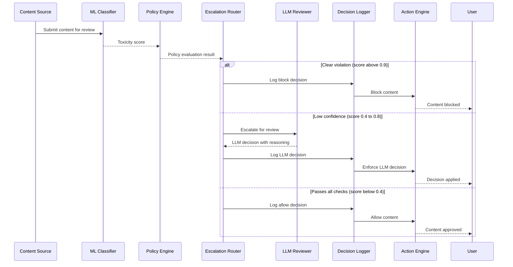

# LLM Content Moderation - Process Flow

**Key Decision Points:**
1. **Score Threshold**: Score above 0.9 triggers immediate block; 0.4-0.8 escalates to LLM review
2. **LLM Escalation**: Reserved for borderline cases to keep cost low; processes ~5% of content
3. **Decision Logging**: Every decision logged regardless of outcome for audit trail
4. **Action Enforcement**: Block, flag, soft-filter, or allow based on policy configuration

**Optimization Points:**
- Rule-based pre-filter eliminates 60-70% of content before ML model inference
- ML classifier handles 25-30%; only 5% reaches expensive LLM reviewer
- Async logging does not block the enforcement action response path
