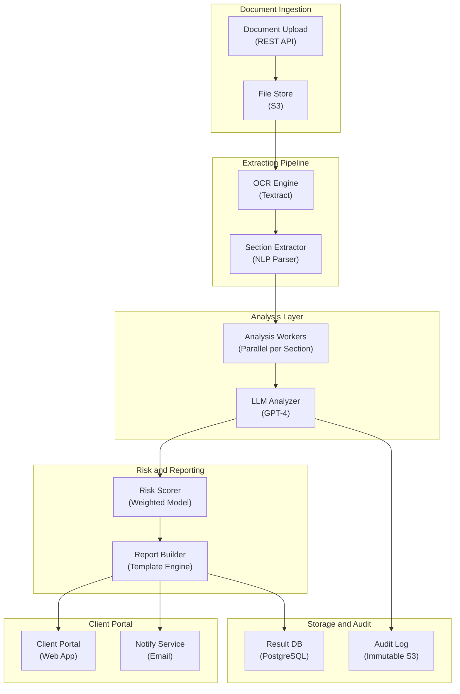

# AI Legal Document Analysis - System Architecture

**Infrastructure Components:**
- **OCR Engine**: AWS Textract for PDF/scanned document text extraction
- **Section Extractor**: NLP-based document structure parser (clauses, sections, definitions)
- **Analysis Workers**: Parallel worker pool processing independent document sections
- **LLM Analyzer**: GPT-4 with legal-domain prompts for clause interpretation and risk flagging
- **Risk Scorer**: Weighted model combining LLM outputs into document-level risk score
- **Audit Log**: Immutable log of all LLM inputs/outputs for professional liability compliance
