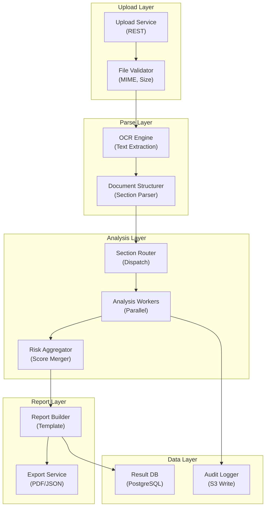

# AI Legal Document Analysis - Application Architecture

**Layer Breakdown:**
- **Upload Layer**: File validation (MIME type, size limit, malware scan) before processing
- **Parse Layer**: OCR text extraction, then section/clause boundary detection
- **Analysis Layer**: Parallel section analysis workers, risk score aggregation across sections
- **Report Layer**: Template-based report generation with PDF and JSON export options
- **Data Layer**: Result persistence and immutable audit log of all AI analysis decisions
