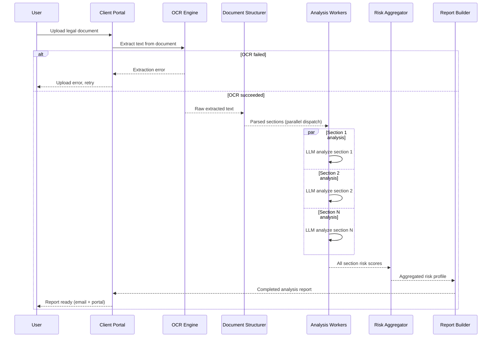

# AI Legal Document Analysis - Process Flow

**Key Decision Points:**
1. **OCR Quality Check**: Low confidence OCR score triggers manual review request before processing
2. **Parallel Section Analysis**: Independent sections analyzed concurrently to minimize total latency
3. **Risk Aggregation**: Section-level scores combined with weights (e.g., indemnity clauses weighted higher)
4. **Report Delivery**: Both portal notification and email delivery on completion

**Optimization Points:**
- Parallel section analysis reduces wall-clock time from O(N sections) to ~O(1) with enough workers
- LLM prompt caching for common clause patterns reduces cost on similar documents
- OCR result cached to avoid re-processing if same document uploaded again
